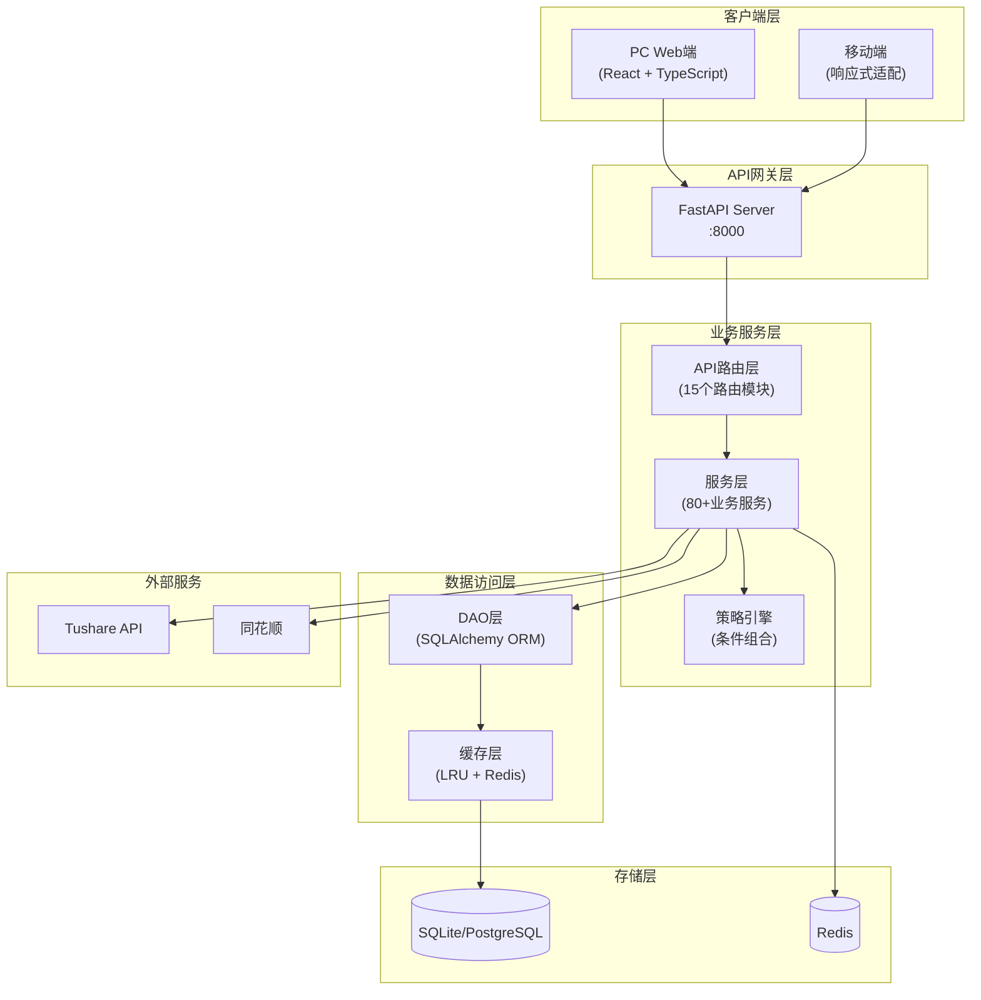
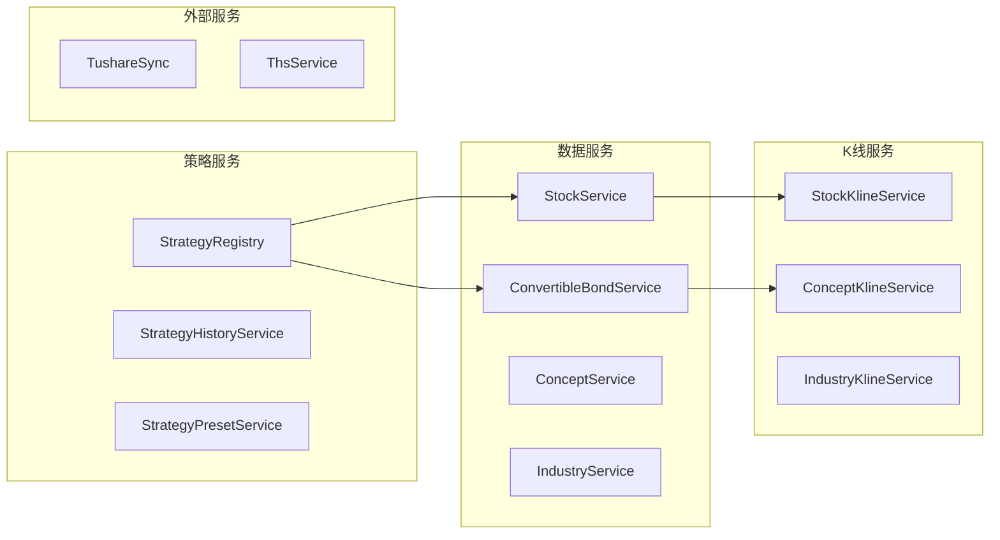
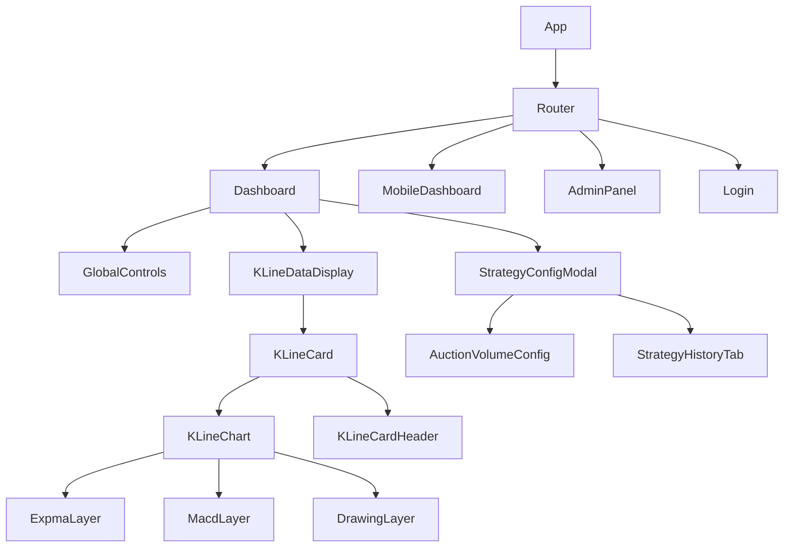
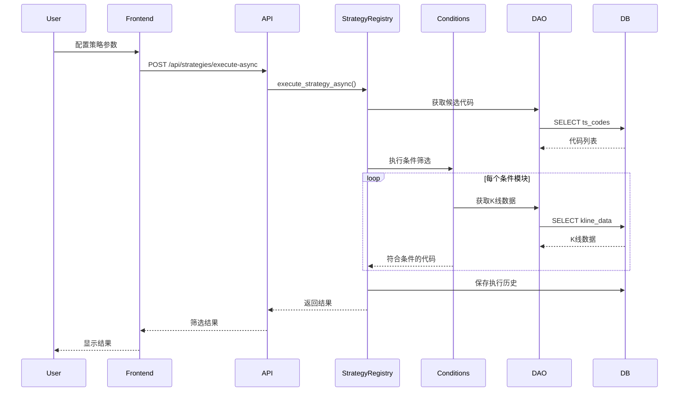
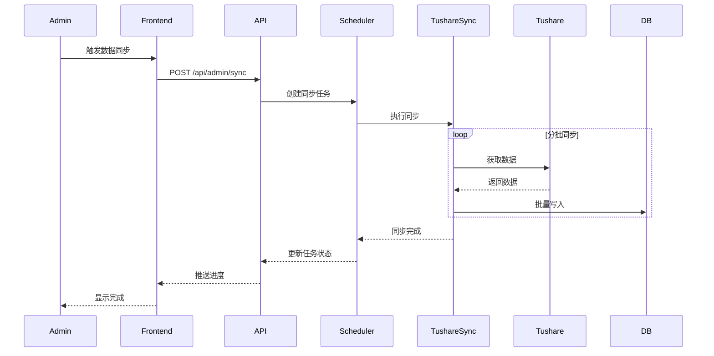
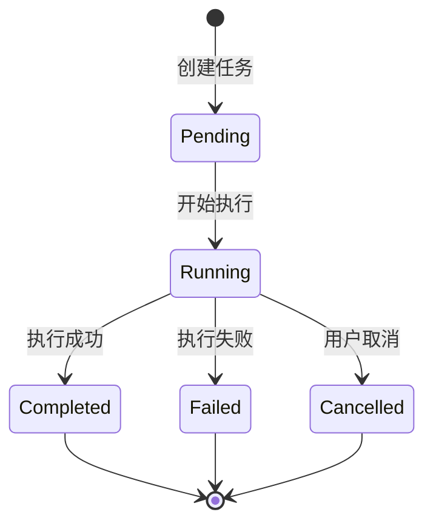

# Quantify 系统架构

[← 返回 README](README.md)

## 目录
1. [整体架构](#1-整体架构)
2. [后端架构](#2-后端架构)
3. [前端架构](#3-前端架构)
4. [数据流设计](#4-数据流设计)
5. [核心模块详解](#5-核心模块详解)
6. [设计模式](#6-设计模式)

---

## 1. 整体架构

### 1.1 架构概览



### 1.2 分层职责

| 层级 | 职责 | 主要文件 |
|------|------|----------|
| **API层** | 请求路由、参数校验、响应封装 | `app/api/*.py` |
| **服务层** | 业务逻辑、数据处理、外部接口调用 | `app/services/**/*.py` |
| **DAO层** | 数据库操作、查询优化、事务管理 | `app/dao/*.py` |
| **模型层** | 数据结构定义、关系映射 | `app/models/**/*.py` |
| **策略层** | 筛选条件实现、策略组合 | `app/strategies/**/*.py` |

---

## 2. 后端架构

### 2.1 目录结构

```
backend/
├── main.py                     # 应用入口，FastAPI实例配置
├── app/
│   ├── api/                    # API路由层 (15个模块)
│   │   ├── __init__.py         # 路由注册
│   │   ├── admin.py            # 管理员接口 (数据同步、任务管理)
│   │   ├── stocks.py           # 股票接口 (列表、详情、K线)
│   │   ├── convertible_bonds.py# 可转债接口
│   │   ├── concepts.py         # 概念板块接口
│   │   ├── industries.py       # 行业板块接口
│   │   ├── strategies.py       # 策略执行接口
│   │   ├── strategy_history.py # 策略执行历史
│   │   ├── favorites.py        # 收藏功能接口
│   │   ├── user.py             # 用户认证接口
│   │   ├── tasks.py            # 任务状态接口
│   │   ├── ths_login.py        # 同花顺登录接口
│   │   ├── ths_accounts.py     # 同花顺账户管理
│   │   └── trade_calendar.py   # 交易日历接口
│   │
│   ├── services/               # 服务层 (80+服务)
│   │   ├── core/               # 核心服务
│   │   │   ├── redis_task_manager.py  # Redis任务管理
│   │   │   ├── task_manager.py        # 任务队列管理
│   │   │   └── database.py            # 数据库连接
│   │   ├── data/               # 数据服务 (17个)
│   │   │   ├── stock_service.py       # 股票数据服务
│   │   │   ├── stock_kline_service.py # 股票K线服务
│   │   │   ├── convertible_bond_service.py
│   │   │   ├── concept_service.py
│   │   │   ├── industry_service.py
│   │   │   ├── indicator_service.py   # 技术指标计算
│   │   │   └── trade_calendar_service.py
│   │   ├── external/           # 外部服务
│   │   │   ├── tushare/        # Tushare数据同步
│   │   │   └── ths/            # 同花顺接口
│   │   ├── management/         # 管理服务
│   │   │   ├── strategy_registry.py   # 策略注册中心
│   │   │   ├── strategy_history_service.py
│   │   │   └── strategy_preset_service.py
│   │   ├── scheduler/          # 调度服务
│   │   │   ├── scheduler.py    # Cron调度器
│   │   │   └── task_executor.py
│   │   └── user/               # 用户服务
│   │       └── user_service.py
│   │
│   ├── dao/                    # 数据访问层 (32个模块)
│   │   ├── base_dao.py         # DAO基类
│   │   ├── stock_dao.py        # 股票DAO
│   │   ├── convertible_bond_dao.py
│   │   ├── concept_dao.py
│   │   ├── industry_dao.py
│   │   ├── kline_query_utils.py# K线查询工具
│   │   ├── query_utils.py      # 通用查询工具
│   │   └── strategies/         # 策略相关DAO
│   │       ├── sorting_strategy.py    # 排序策略
│   │       └── ...
│   │
│   ├── models/                 # 数据模型 (26个)
│   │   ├── base/               # 基础模型
│   │   │   ├── base_model.py
│   │   │   └── mixins.py
│   │   ├── entities/           # 实体模型
│   │   │   ├── stock.py
│   │   │   ├── convertible_bond.py
│   │   │   ├── concept.py
│   │   │   └── industry.py
│   │   ├── klines/             # K线模型
│   │   │   ├── stock_kline.py
│   │   │   └── ...
│   │   └── management/         # 管理模型
│   │       ├── user.py
│   │       ├── strategy_history.py
│   │       └── strategy_preset.py
│   │
│   ├── strategies/             # 策略引擎
│   │   ├── __init__.py
│   │   ├── auction_volume.py   # 量价趋势策略入口
│   │   └── conditions/         # 策略条件模块
│   │       ├── __init__.py     # 条件注册中心
│   │       ├── volume.py       # 量条件
│   │       ├── price.py        # 价条件
│   │       ├── trend_m.py      # 趋势条件1 (均线)
│   │       ├── trend_cross.py  # 趋势条件2 (EXPMA偏离)
│   │       └── trend_converge.py # 趋势条件3 (趋势收敛)
│   │
│   ├── constants/              # 常量定义
│   │   ├── entity_types.py     # 实体类型常量
│   │   └── table_types.py      # 表类型常量
│   │
│   └── utils/                  # 工具函数
│       ├── concurrent_utils.py # 并发处理
│       └── ...
```

### 2.2 API路由设计

| 路由模块 | 端点前缀 | 功能描述 |
|----------|----------|----------|
| `stocks.py` | `/api/stocks` | 股票列表、详情、K线数据 |
| `convertible_bonds.py` | `/api/bonds` | 可转债数据 |
| `concepts.py` | `/api/concepts` | 概念板块数据 |
| `industries.py` | `/api/industries` | 行业板块数据 |
| `strategies.py` | `/api/strategies` | 策略执行、预设管理 |
| `favorites.py` | `/api/favorites` | 收藏分组管理 |
| `user.py` | `/api/user` | 登录、注册、认证 |
| `admin.py` | `/api/admin` | 数据同步、系统管理 |
| `tasks.py` | `/api/tasks` | 任务状态查询 |

### 2.3 服务层设计



---

## 3. 前端架构

### 3.1 目录结构

```
frontend/src/
├── App.tsx                     # 应用入口，路由配置
├── index.tsx                   # React DOM渲染
│
├── pages/                      # 页面组件 (9个)
│   ├── Dashboard.tsx           # 主看板页面
│   ├── MobileDashboard.tsx     # 移动端看板
│   ├── AdminPanel.tsx          # 管理后台
│   ├── Login.tsx               # 登录页
│   ├── Relogin.tsx             # 同花顺重登录
│   └── NotFound.tsx            # 404页面
│
├── components/                 # UI组件 (45+)
│   ├── KLineChart.tsx          # K线图表核心组件
│   ├── KLineCard.tsx           # K线卡片组件
│   ├── KLineDataDisplay.tsx    # 数据展示组件
│   ├── StrategyConfigModal.tsx # 策略配置弹窗
│   ├── StrategyHistoryTab.tsx  # 策略执行历史
│   ├── GlobalControls.tsx      # 全局控制栏
│   ├── TradingCalendar.tsx     # 交易日历
│   ├── UserMenu.tsx            # 用户菜单
│   │
│   ├── admin/                  # 管理组件 (7个)
│   │   ├── DataSyncPanel.tsx   # 数据同步面板
│   │   ├── SchedulerPanel.tsx  # 调度器面板
│   │   └── StrategyPushConfig.tsx # 策略推送配置
│   │
│   ├── mobile/                 # 移动端组件 (57个)
│   │   ├── BottomDrawer.tsx    # 底部抽屉
│   │   ├── SwipeableList.tsx   # 滑动列表
│   │   └── ...
│   │
│   └── chart-layers/           # 图表图层 (24个)
│       ├── ExpmaLayer.tsx      # EXPMA指标层
│       ├── MacdLayer.tsx       # MACD指标层
│       └── DrawingLayer.tsx    # 绘图层
│
├── hooks/                      # 自定义Hooks (19个)
│   ├── useChartInstance.ts     # 图表实例管理
│   ├── useKLineData.ts         # K线数据获取
│   ├── useTaskProgress.ts      # 任务进度监听
│   ├── useSchedulerTasks.ts    # 调度器任务
│   └── useMobileDetection.ts   # 移动端检测
│
├── stores/                     # 状态管理
│   └── globalStore.ts          # 全局状态
│
├── strategies/                 # 策略配置UI
│   ├── AuctionVolumeConfig.tsx # 量价趋势策略配置
│   └── useStrategiesMeta.ts    # 策略元数据
│
├── types/                      # TypeScript类型
│   ├── stock.ts
│   ├── kline.ts
│   └── strategy.ts
│
└── utils/                      # 工具函数
    ├── authFetch.ts            # 认证请求封装
    ├── formatters.ts           # 数据格式化
    └── ...
```

### 3.2 组件层次



### 3.3 状态管理

| 状态类型 | 管理方式 | 用途 |
|----------|----------|------|
| **组件状态** | `useState` | UI交互状态 |
| **表单状态** | Ant Design Form | 策略配置表单 |
| **全局状态** | Context + Store | 用户信息、主题 |
| **服务端状态** | 自定义Hooks | K线数据、任务状态 |

---

## 4. 数据流设计

### 4.1 策略执行流程



### 4.2 数据同步流程



---

## 5. 核心模块详解

### 5.1 策略条件系统

策略引擎采用**插件化设计**，每个筛选条件作为独立模块注册：

```python
# app/strategies/conditions/__init__.py
conditions_registry = {}

def register_condition(key, label, type, execute_fn, ...):
    """注册条件模块"""
    conditions_registry[key] = {
        'label': label,
        'type': type,
        'execute': execute_fn,
        ...
    }
```

**已实现条件模块**：

| 条件 | 文件 | 功能 |
|------|------|------|
| 量条件 | `volume.py` | 竞价量/高开量倍数筛选 |
| 振幅筛选 | `price.py` | 平均振幅过滤 |
| 涨停筛选 | `price.py` | 历史涨停次数筛选 |
| 趋势条件1 | `trend_m.py` | AB线多头/空头排列 |
| 趋势条件2 | `trend_cross.py` | EXPMA偏离度筛选 |
| 趋势条件3 | `trend_converge.py` | 趋势收敛筛选 |

### 5.2 K线图表系统

基于 `lightweight-charts` 的图表系统，支持：

- **多图层架构**：主图层 + 指标图层 + 绘图图层
- **自定义指标**：EXPMA、MACD等
- **交互功能**：缩放、拖拽、十字线
- **绘图工具**：趋势线、水平线

### 5.3 任务管理系统



---

## 6. 设计模式

### 6.1 使用的设计模式

| 模式 | 应用场景 |
|------|----------|
| **注册表模式** | 策略条件注册、实体类型映射 |
| **服务层模式** | 业务逻辑封装 |
| **DAO模式** | 数据访问抽象 |
| **工厂模式** | 实体服务创建 |
| **观察者模式** | 任务进度推送 |
| **策略模式** | 排序策略选择 |

### 6.2 代码规范

- **后端**：Python PEP 8、类型注解
- **前端**：ESLint + Prettier、TypeScript严格模式
- **提交**：Conventional Commits

---

[← 返回 README](README.md) | [用户指南 →](USER_GUIDE.md)
