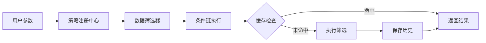

# 面试准备指南

> 本文档汇总项目亮点、技术难点和面试常见问题，帮助你在面试中全面展示项目能力。

---

## 目录
1. [项目简介一分钟版](#1-项目简介一分钟版)
2. [技术亮点汇总](#2-技术亮点汇总)
3. [核心模块深度解析](#3-核心模块深度解析)
4. [技术难点与解决方案](#4-技术难点与解决方案)
5. [架构设计决策](#5-架构设计决策)
6. [常见面试问题](#6-常见面试问题)
7. [项目数据指标](#7-项目数据指标)

---

## 1. 项目简介一分钟版

> **一句话描述**: 一个支持多条件组合筛选股票/可转债的量化分析平台，具备完整的前后端实现和多端适配。

### 核心功能
- 📊 多维度K线图表展示（日/周/月线 + 技术指标）
- 🎯 策略引擎（量/价/趋势多条件组合筛选）
- 🔄 数据自动同步（Tushare数据源）
- 📱 PC/移动端双端适配
- 🔐 同花顺账号集成（扫码登录 + 自选股推送）

### 技术栈
```
前端: React 18 + TypeScript + Vite + Ant Design + ECharts
后端: Python + FastAPI + SQLAlchemy + Redis
数据: MySQL/SQLite + Tushare Pro
部署: 宝塔面板 + Nginx + PM2
```

---

## 2. 技术亮点汇总

| 模块 | 技术亮点 | 关键词 |
|------|----------|--------|
| **策略引擎** | 注册表模式、条件链、参数哈希去重 | 设计模式、性能优化 |
| **K线图表** | ECharts封装、画线工具、多指标叠加 | 可视化、交互设计 |
| **异步任务** | Redis任务队列、进度推送、优雅取消 | 分布式、实时通信 |
| **外部集成** | Tushare频率控制、同花顺扫码登录 | 第三方API、安全 |
| **数据层** | DAO模式、批量查询优化、多级缓存 | 架构设计、性能 |
| **移动适配** | 响应式设计、触摸事件、组件变体 | 移动开发 |

---

## 3. 核心模块深度解析

### 3.1 策略引擎



**代码量**: 策略注册中心 757行，6个条件模块共计 1500+行

**设计亮点**:
1. **注册表模式**: 解耦策略定义与执行，支持运行时动态注册
2. **条件变体机制**: 同一条件支持不同标的类型的特化实现
3. **参数哈希**: 相同参数直接返回缓存结果

### 3.2 K线图表组件

**代码量**: KLineChart.tsx 828行

**核心功能**:
- 主图: K线 + MA/EMA/BOLL 叠加
- 副图: MACD/KDJ/RSI/成交量
- 交互: 缩放平移、十字光标、画线工具
- 适配: PC/移动端响应式

**性能优化**:
```tsx
// 自定义memo比较函数
const KLineChart = React.memo(KLineChartInner, (prev, next) => {
  return prev.ts_code === next.ts_code && prev.period === next.period;
});
```

### 3.3 异步任务系统

**代码量**: RedisTaskManager 528行

**功能**:
- 任务创建、执行、取消
- 进度实时推送 (Redis Pub/Sub)
- 僵尸任务检测与清理
- 多实例部署支持

**状态机**:
```
PENDING → RUNNING → COMPLETED/FAILED
             ↓
          CANCELLING → CANCELLED
```

---

## 4. 技术难点与解决方案

### 难点1: Tushare API频率限制

**问题**: 不同接口有不同频率限制，超限会被封禁

**解决方案**:
```python
# 接口级频率策略
_rate_policies = {
    'daily': {'per_minute': 400, 'per_second': 10},
    'ths_member': {'per_minute': 200, 'per_second': 5},
}

# 线程锁 + 调用时间记录 + 自动等待
with self._rate_lock:
    self._wait_if_rate_limited(api_name)
    result = self.pro.query(api_name, **kwargs)
    self._record_call(api_name)
```

### 难点2: 同花顺登录态保持

**问题**: Cookie会过期，需要自动重登录

**解决方案**:
1. 检测401响应触发重登录流程
2. 支持密码/短信/扫码多种方式
3. 密码使用Fernet对称加密存储
4. 失败时通过PushPlus推送通知

### 难点3: 大量股票的筛选性能

**问题**: 5000+股票全量筛选耗时长

**解决方案**:
1. 先通过概念/行业/市值预筛选缩小范围
2. 批量获取K线数据，减少数据库查询次数
3. 相同参数结果缓存，直接返回
4. 进度分阶段推送，用户可随时取消

### 难点4: K线图表画线持久化

**问题**: 用户绘制的线需要保存和恢复

**解决方案**:
```typescript
// LocalStorage存储
const saveDrawings = (tsCode: string, drawings: DrawingLine[]) => {
  const key = `kline_drawings_${tsCode}`;
  localStorage.setItem(key, JSON.stringify(drawings));
};

// 组件加载时恢复
useEffect(() => {
  const saved = localStorage.getItem(`kline_drawings_${ts_code}`);
  if (saved) setDrawings(JSON.parse(saved));
}, [ts_code]);
```

---

## 5. 架构设计决策

### 5.1 为什么选择FastAPI而不是Django/Flask？

| 对比项 | FastAPI | Django | Flask |
|--------|---------|--------|-------|
| 异步支持 | ✅ 原生 | ⚠️ 需配置 | ⚠️ 需扩展 |
| 类型提示 | ✅ Pydantic | ❌ | ❌ |
| 自动文档 | ✅ Swagger | ⚠️ 需配置 | ⚠️ 需扩展 |
| 性能 | ⭐⭐⭐⭐⭐ | ⭐⭐⭐ | ⭐⭐⭐⭐ |
| 学习曲线 | 中 | 高 | 低 |

**结论**: FastAPI在异步性能和开发体验上有明显优势

### 5.2 为什么使用Redis而不是内存存储任务状态？

1. **多实例支持**: 生产环境可能有多个后端实例
2. **持久化**: 服务重启不丢失任务状态
3. **Pub/Sub**: 原生支持进度推送
4. **TTL**: 自动清理过期任务

### 5.3 为什么前端选择Vite而不是CRA？

1. **启动速度**: Vite秒级启动 vs CRA十几秒
2. **HMR性能**: 毫秒级热更新
3. **构建速度**: Rollup比Webpack快
4. **配置简单**: 开箱即用

---

## 6. 常见面试问题

### 项目相关

**Q1: 请介绍一下这个项目**
> 这是一个量化分析平台，核心功能是多条件组合选股。用户可以配置量/价/趋势等多维度条件，系统会筛选出符合条件的股票。技术上采用前后端分离架构，前端React + TypeScript，后端FastAPI + Redis，策略引擎采用注册表模式实现灵活扩展。

**Q2: 项目中最有挑战的部分是什么？**
> 策略引擎的设计。需要支持多种条件的灵活组合，同时保证筛选5000+股票的性能。我采用了注册表模式解耦条件定义与执行，通过批量查询和结果缓存优化性能，最终将全量筛选时间控制在10秒以内。

**Q3: 你在项目中负责哪些部分？**
> 我独立完成了整个项目的开发：
> - 后端策略引擎、数据同步、异步任务系统
> - 前端K线图表、策略配置、移动端适配
> - 第三方集成（Tushare、同花顺、PushPlus）
> - 部署运维（Nginx + PM2）

### 技术相关

**Q4: 如何保证系统的可扩展性？**
> 主要通过设计模式：
> 1. 策略模式 + 注册表模式：新增条件只需实现接口并注册
> 2. DAO模式：数据库操作与业务逻辑解耦
> 3. 服务层抽象：业务逻辑集中，便于单元测试

**Q5: 如何处理高并发场景？**
> 多层优化：
> 1. Redis缓存K线数据，减少数据库压力
> 2. 策略结果缓存，相同参数直接返回
> 3. 异步任务队列，避免阻塞请求线程
> 4. 数据库连接池，控制并发连接数

**Q6: 前端状态管理方案？**
> 采用分层管理：
> 1. 全局状态（认证）：Context + localStorage
> 2. 服务端状态：SWR自动缓存
> 3. 组件状态：useState / Ant Design Form
> 避免过度使用Redux，保持代码简洁

---

## 7. 项目数据指标

### 代码统计

| 模块 | 文件数 | 代码行数 |
|------|--------|----------|
| 后端核心 | 79 | ~15,000 |
| 前端组件 | 40+ | ~10,000 |
| 文档 | 15 | ~3,000 |
| **总计** | **134+** | **~28,000** |

### 核心文件

| 文件 | 行数 | 功能 |
|------|------|------|
| `strategy_registry.py` | 757 | 策略引擎核心 |
| `tushare_service.py` | 1219 | Tushare数据服务 |
| `KLineChart.tsx` | 828 | K线图表组件 |
| `StrategyConfigModal.tsx` | 980 | 策略配置模态框 |
| `admin.py` | 1268 | 管理端API |

### 功能覆盖

- ✅ 股票/可转债/概念/行业 四类标的
- ✅ 日/周/月 三种K线周期
- ✅ 6种筛选条件模块
- ✅ 扫码/密码/短信 三种登录方式
- ✅ PC/移动端 双端适配

---

## 准备建议

1. **熟读架构文档**: [BACKEND_ARCHITECTURE.md](backend/docs/BACKEND_ARCHITECTURE.md)、[FRONTEND_ARCHITECTURE.md](frontend/docs/FRONTEND_ARCHITECTURE.md)
2. **理解核心代码**: 策略注册中心、K线图表组件
3. **准备STAR法则**: 针对每个技术难点准备完整案例
4. **模拟回答**: 对着镜子练习项目介绍（控制在2分钟内）

---

祝面试顺利！🎯
