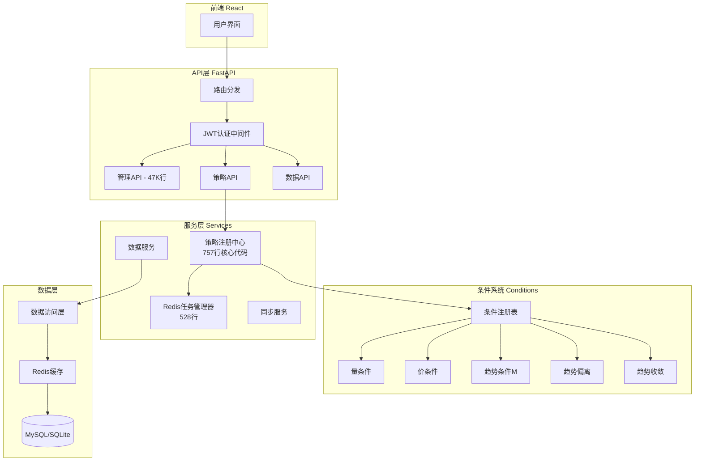
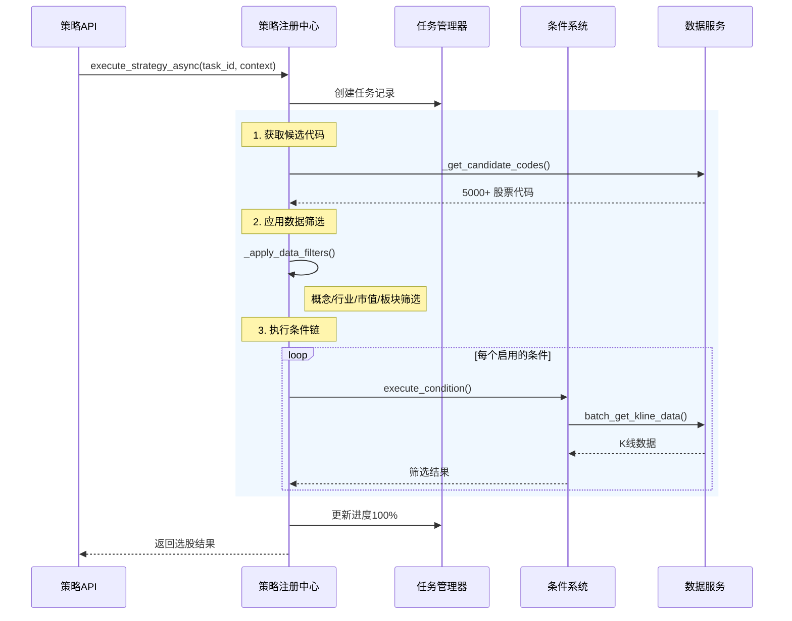
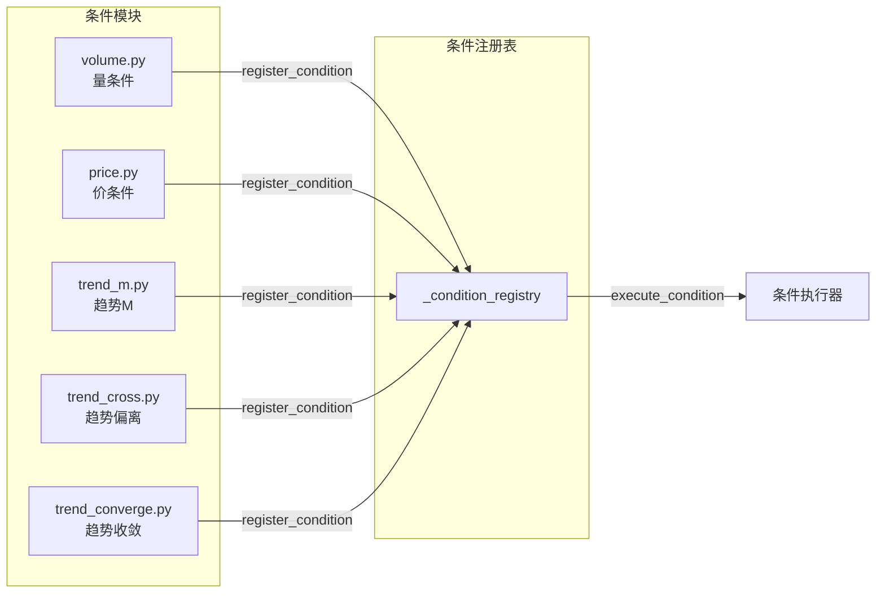
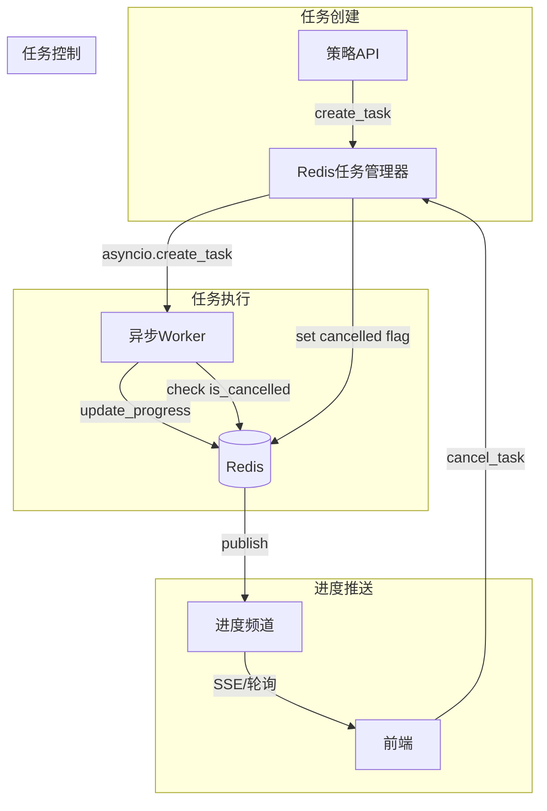
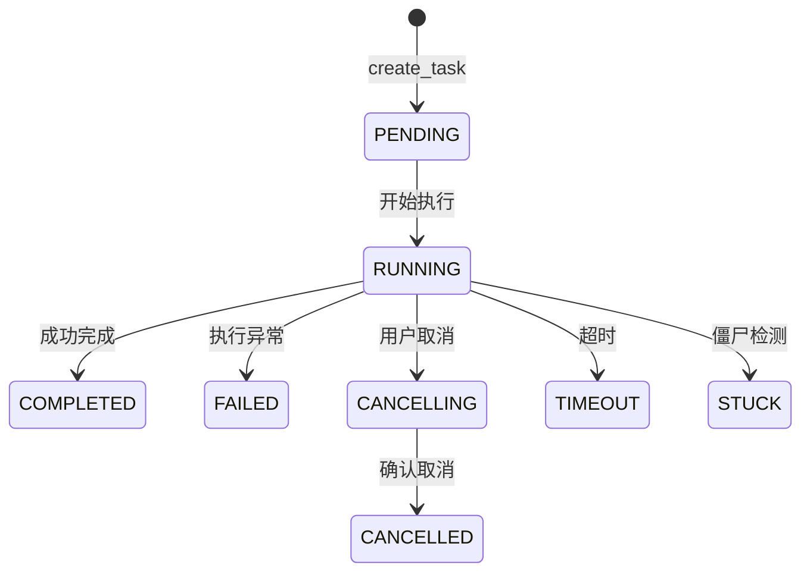
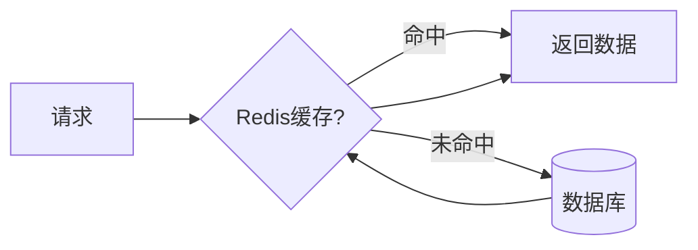

# 后端架构深度解析

> 本文档详细介绍后端核心模块的设计思想和实现逻辑，适合面试准备和项目理解。

[← 返回后端总览](BACKEND_OVERVIEW.md)

---

## 目录
1. [系统架构全景](#1-系统架构全景)
2. [核心设计模式](#2-核心设计模式)
3. [策略引擎详解](#3-策略引擎详解)
4. [条件系统设计](#4-条件系统设计)
5. [异步任务系统](#5-异步任务系统)
6. [数据层架构](#6-数据层架构)
7. [亮点技术实现](#7-亮点技术实现)
8. [面试问答准备](#8-面试问答准备)

---

## 1. 系统架构全景



### 1.1 分层架构说明

| 层级 | 职责 | 关键文件 |
|------|------|----------|
| **API层** | 路由、认证、请求校验 | `app/api/*.py` (15个模块) |
| **服务层** | 业务逻辑核心 | `app/services/` (79个文件) |
| **策略层** | 选股策略执行 | `app/strategies/` (10个文件) |
| **DAO层** | 数据库操作封装 | `app/dao/` (32个文件) |
| **模型层** | 数据结构定义 | `app/models/` (26个文件) |

---

## 2. 核心设计模式

### 2.1 注册表模式 (Registry Pattern)

**应用场景**: 策略注册、条件注册

```python
# 条件注册（策略模式的变体）
_condition_registry: Dict[str, Dict[str, Any]] = {}

def register_condition(key, label, execute_fn, ...):
    """注册一个条件处理器"""
    _condition_registry[key] = {
        "key": key,
        "execute": execute_fn,
        ...
    }

# 使用时动态解析
def execute_condition(key, candidates, context, ...):
    condition = _condition_registry.get(key)
    return condition["execute"](candidates, context, ...)
```

**优点**:
- 解耦条件定义与执行
- 支持运行时动态注册
- 便于扩展新条件

### 2.2 策略模式 + 工厂模式

**应用场景**: 多条件筛选策略

```python
class StrategyRegistry:
    def __init__(self):
        self._strategies = {}  # 策略注册表
        self._register_auction_volume()  # 注册内置策略
    
    def execute_strategy_async(self, task_id, strategy_name, context):
        """统一执行入口"""
        handler = self._strategies.get(strategy_name)
        return handler(context)
```

### 2.3 装饰器模式

**应用场景**: 权限控制

```python
# 依赖注入式权限装饰器
async def get_admin_running_tasks(user: AdminUser):
    # AdminUser 类型自动进行管理员权限检查
    ...

async def trigger_scheduler_task(user: AdminWriteUser):
    # AdminWriteUser 类型要求超级管理员权限
    ...
```

### 2.4 单例模式

**应用场景**: 全局服务实例

```python
# 模块级单例（Python惯用法）
class RedisTaskManager:
    def __init__(self):
        self._redis = None  # 延迟初始化
        
redis_task_manager = RedisTaskManager()  # 全局唯一实例
```

---

## 3. 策略引擎详解

### 3.1 执行流程



### 3.2 核心代码解析

```python
# strategy_registry.py 核心逻辑

async def execute_strategy_async(self, task_id, strategy_name, context, user_id):
    """异步执行策略 - 完整流程"""
    
    # 1️⃣ 检查历史缓存（相同参数直接返回）
    context_hash = self._compute_context_hash(context)
    cached = strategy_history_service.get_by_context_hash(context_hash)
    if cached and cached.status == "success":
        return cached.selected_codes
    
    # 2️⃣ 获取候选代码
    candidates = self._get_candidate_codes(context)
    # 应用数据筛选（概念/行业/市值/板块）
    candidates = self._apply_data_filters(candidates, context, entity_type)
    
    # 3️⃣ 批量获取K线数据（带缓存）
    kline_data = self._batch_get_kline_data(candidates, limit, entity_type, period)
    
    # 4️⃣ 执行条件链筛选
    selected = self._execute_strategy_batch(strategy_name, candidates, context)
    
    # 5️⃣ 保存历史记录
    strategy_history_service.create_history(...)
    
    return selected
```

### 3.3 数据筛选器

```python
def _apply_data_filters(candidates, context, entity_type):
    """多维度数据筛选"""
    filtered = set(candidates)
    
    # 1. 概念筛选
    if context.get("selected_concepts"):
        concept_codes = concept_service.get_ts_codes_by_concepts(...)
        filtered &= set(concept_codes)
    
    # 2. 行业筛选
    if context.get("selected_industries"):
        industry_codes = industry_service.get_ts_codes_by_industries(...)
        filtered &= set(industry_codes)
    
    # 3. 市值筛选
    if context.get("enable_circ_mv"):
        mv_codes = stock_service.get_ts_codes_by_circ_mv_range(...)
        filtered &= set(mv_codes)
    
    # 4. 板块筛选 (创业板/科创板/北交所/ST)
    if has_board_filter:
        # 支持"只保留"和"排除"两种模式
        if filter_mode == "include":
            filtered = codes_to_keep
        else:
            filtered -= codes_to_remove
    
    return list(filtered)
```

---

## 4. 条件系统设计

### 4.1 条件注册表架构



### 4.2 条件变体机制

支持同一条件类型的不同实现：

```python
# 解析顺序
# 1. volume_stock (股票专用)
# 2. volume (通用版)

def resolve_condition_for_entity(condition_type, entity_type):
    """智能解析条件实现"""
    # 优先级1: 标的专用版
    specific_key = f"{condition_type}_{entity_type}"  # volume_stock
    if specific_cond := get_condition(specific_key):
        return specific_cond
    
    # 优先级2: 通用版
    return get_condition(condition_type)  # volume
```

### 4.3 量条件实现详解

```python
# volume.py - 核心筛选逻辑

def _check_volume_conditions(klines, window_n, volume_multiple, ...):
    """
    条件：当天量 >= 前N天平均量 × 倍数
    
    例如: window_n=5, volume_multiple=2.0
    -> 今天成交量 >= 过去5天平均量 × 2
    """
    # 提取量序列 [今天, 昨天, 前天, ...]
    volumes = [kline.get(volume_field) for kline in klines]
    
    latest = volumes[0]
    avg = sum(volumes[1:window_n+1]) / window_n
    
    # 基础条件
    if latest <= avg * volume_multiple:
        return False
    
    # 排除条件1: 非首次爆量（排除第一天就爆量的）
    if exclude_first_burst_days:
        ...
    
    # 排除条件2: 过滤绝对值太小的
    if exclude_low_avg_percent:
        ...
    
    return True
```

### 4.4 条件参数表

| 条件 | 参数 | 说明 |
|------|------|------|
| **量条件** | `window_n`, `volume_multiple` | N天窗口，X倍阈值 |
| **价条件** | `amplitude_days_window`, `min_avg_amplitude` | 振幅窗口，最小振幅% |
| **趋势M** | `m_days`, `ab_up_series` | M日内，多头排列选项 |
| **趋势偏离** | `cross_expma_periods`, `cross_threshold` | EXPMA周期，偏离阈值% |
| **趋势收敛** | `converge_line_pairs`, `converge_window` | 线对，观察窗口 |

---

## 5. 异步任务系统

### 5.1 架构设计



### 5.2 任务状态机



### 5.3 关键代码

```python
# redis_task_manager.py

class RedisTaskManager:
    def create_task(self, name, task_func, code=None, *args, **kwargs):
        """创建并启动异步任务"""
        task_id = str(uuid.uuid4())
        
        # 保存任务元数据到Redis
        progress = TaskProgress(task_id=task_id, name=name, code=code)
        self._save_task_progress(progress)
        
        # 启动异步执行
        asyncio.create_task(self._execute_task(task_id, task_func, *args, **kwargs))
        
        return task_id
    
    def update_task_progress(self, task_id, progress, message, ...):
        """更新进度并发布通知"""
        # 更新Redis中的进度数据
        task_data = self._get_task_data(task_id)
        task_data["progress"] = progress
        task_data["message"] = message
        self._save_task_data(task_id, task_data)
        
        # 发布到Redis频道（前端通过SSE订阅）
        self._publish_progress_update(task_id)
    
    def is_task_cancelled(self, task_id):
        """检查任务是否被取消（执行中周期性检查）"""
        return self._redis.get(f"task:{task_id}:cancelled") == "1"
```

### 5.4 僵尸任务检测

```python
def _is_task_stale(self, task_data, stale_threshold_hours):
    """检测僵尸任务"""
    # 条件1: 进度100%但状态仍为running
    if task_data["progress"] >= 100 and task_data["status"] == "running":
        return True
    
    # 条件2: 长时间无更新
    last_update = parse_datetime(task_data["updated_at"])
    if (now - last_update).hours > stale_threshold_hours:
        return True
    
    return False
```

---

## 6. 数据层架构

### 6.1 DAO模式

```python
# 典型DAO实现
class StockDAO:
    def get_all(self) -> List[Stock]:
        with get_db() as db:
            return db.query(Stock).all()
    
    def get_by_ts_code(self, ts_code: str) -> Optional[Stock]:
        with get_db() as db:
            return db.query(Stock).filter(Stock.ts_code == ts_code).first()
    
    def batch_insert(self, stocks: List[Stock]):
        with get_db() as db:
            db.bulk_save_objects(stocks)
            db.commit()
```

### 6.2 缓存策略



**缓存实现**:
```python
from functools import lru_cache

class StockService:
    @lru_cache(maxsize=1)
    def get_all_ts_codes_cached(self) -> List[str]:
        """全量股票代码缓存"""
        return stock_dao.get_all_ts_codes()
    
    def batch_get_indicators_cached(self, ts_codes, limit, ...):
        """批量指标数据缓存"""
        cache_key = f"indicators:{hash(ts_codes)}:{limit}"
        if cached := redis.get(cache_key):
            return json.loads(cached)
        
        data = self._fetch_from_db(ts_codes, limit)
        redis.setex(cache_key, 3600, json.dumps(data))
        return data
```

---

## 7. 亮点技术实现

### 7.1 参数哈希去重

```python
def _compute_context_hash(context):
    """计算策略参数哈希，相同参数直接复用结果"""
    # 排除不影响结果的参数
    hash_context = {k: v for k, v in context.items() 
                    if k not in ["user_id", "task_id"]}
    return hashlib.md5(json.dumps(hash_context, sort_keys=True)).hexdigest()
```

### 7.2 批量数据获取优化

```python
def batch_get_kline_data(candidates, limit, ...):
    """批量获取K线，减少数据库查询次数"""
    # 不是逐个查询，而是一次获取所有
    all_klines = kline_dao.batch_get_by_codes(candidates, limit)
    
    # 按股票代码分组
    grouped = defaultdict(list)
    for kline in all_klines:
        grouped[kline.ts_code].append(kline.to_dict())
    
    return grouped
```

### 7.3 优雅的取消机制

```python
async def execute_strategy_async(self, task_id, ...):
    for i, batch in enumerate(batches):
        # 每个批次检查取消状态
        if redis_task_manager.is_task_cancelled(task_id):
            raise CancellationException("用户取消任务")
        
        # 更新进度
        progress = (i + 1) / len(batches) * 100
        redis_task_manager.update_task_progress(task_id, progress, f"处理批次 {i+1}")
        
        # 处理批次
        await self._process_batch(batch)
```

---

## 8. 面试问答准备

### Q1: 项目整体架构是怎样的？

**答**: 采用前后端分离的 SPA 架构：
- **前端**: React + TypeScript + Ant Design
- **后端**: FastAPI + SQLAlchemy + Redis
- **特点**: 策略引擎采用注册表模式，支持条件的灵活组合；异步任务系统基于 Redis 实现进度推送

### Q2: 策略引擎是如何设计的？

**答**: 策略引擎采用**两级注册表模式**：
1. **策略注册表**: 管理策略入口，如"量价趋势策略"
2. **条件注册表**: 管理筛选条件，如量条件、价条件

执行流程：获取候选代码 → 数据筛选 → 条件链筛选 → 返回结果

### Q3: 如何处理大量股票的筛选性能？

**答**: 多级优化策略：
1. **数据预筛选**: 先通过概念/行业/市值缩小范围
2. **批量查询**: 一次获取所有候选股票的K线数据
3. **结果缓存**: 相同参数的策略结果直接返回
4. **Redis缓存**: K线数据使用Redis缓存，TTL=1小时

### Q4: 异步任务系统如何实现？

**答**: 基于 Redis + asyncio 实现：
1. 任务创建时生成UUID并存入Redis
2. asyncio.create_task 启动异步执行
3. 执行中周期性更新进度到Redis
4. 前端通过 SSE/轮询 获取进度
5. 取消时设置 cancelled 标志，Worker检测后抛出异常

### Q5: 如何保证数据一致性？

**答**: 
1. **数据库事务**: 写操作使用 SQLAlchemy session 事务
2. **参数哈希**: 相同策略参数生成相同hash，避免重复计算
3. **历史记录**: 所有策略执行结果存入history表，支持审计

---

[← 返回后端总览](BACKEND_OVERVIEW.md)
