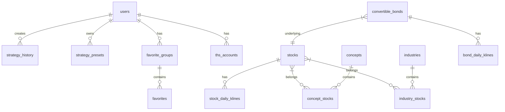

# 数据库设计文档

[← 返回后端总览](BACKEND_OVERVIEW.md)

## 1. 数据库概览

- **开发环境**: SQLite
- **生产环境**: PostgreSQL (推荐)
- **ORM**: SQLAlchemy 2.0

---

## 2. 数据表设计

### 2.1 实体表

#### stocks - 股票基础信息
```sql
CREATE TABLE stocks (
    id INTEGER PRIMARY KEY,
    ts_code VARCHAR(20) NOT NULL UNIQUE,  -- 股票代码 (如 000001.SZ)
    symbol VARCHAR(10),                    -- 证券代码
    name VARCHAR(50),                      -- 股票名称
    area VARCHAR(20),                      -- 地区
    industry VARCHAR(50),                  -- 行业
    market VARCHAR(20),                    -- 市场类型
    list_date VARCHAR(10),                 -- 上市日期
    is_hs VARCHAR(5),                      -- 是否沪深港通
    created_at DATETIME,
    updated_at DATETIME
);
```

#### convertible_bonds - 可转债信息
```sql
CREATE TABLE convertible_bonds (
    id INTEGER PRIMARY KEY,
    ts_code VARCHAR(20) NOT NULL UNIQUE,  -- 转债代码
    bond_short_name VARCHAR(50),          -- 债券简称
    stk_code VARCHAR(20),                 -- 正股代码
    stk_short_name VARCHAR(50),           -- 正股简称
    conv_price DECIMAL(10,4),             -- 转股价格
    issue_size DECIMAL(20,4),             -- 发行规模
    list_date VARCHAR(10),                -- 上市日期
    created_at DATETIME,
    updated_at DATETIME
);
```

#### concepts - 概念板块
```sql
CREATE TABLE concepts (
    id INTEGER PRIMARY KEY,
    code VARCHAR(20) NOT NULL UNIQUE,     -- 概念代码
    name VARCHAR(100),                    -- 概念名称
    src VARCHAR(20),                      -- 来源
    created_at DATETIME,
    updated_at DATETIME
);
```

#### industries - 行业板块
```sql
CREATE TABLE industries (
    id INTEGER PRIMARY KEY,
    code VARCHAR(20) NOT NULL UNIQUE,     -- 行业代码
    name VARCHAR(100),                    -- 行业名称
    level VARCHAR(10),                    -- 级别
    src VARCHAR(20),                      -- 来源
    created_at DATETIME,
    updated_at DATETIME
);
```

### 2.2 K线表

#### stock_daily_klines - 股票日K线
```sql
CREATE TABLE stock_daily_klines (
    id INTEGER PRIMARY KEY,
    ts_code VARCHAR(20) NOT NULL,
    trade_date VARCHAR(10) NOT NULL,
    open DECIMAL(10,4),
    high DECIMAL(10,4),
    low DECIMAL(10,4),
    close DECIMAL(10,4),
    pre_close DECIMAL(10,4),
    change DECIMAL(10,4),
    pct_chg DECIMAL(10,4),          -- 涨跌幅
    vol DECIMAL(20,4),              -- 成交量
    amount DECIMAL(20,4),           -- 成交额
    turnover_rate DECIMAL(10,4),    -- 换手率
    -- 技术指标
    expma_a1 DECIMAL(10,4),         -- EXPMA A1
    expma_a2 DECIMAL(10,4),
    expma_a3 DECIMAL(10,4),
    expma_a4 DECIMAL(10,4),
    expma_b1 DECIMAL(10,4),         -- EXPMA B1
    expma_b2 DECIMAL(10,4),
    expma_b3 DECIMAL(10,4),
    expma_b4 DECIMAL(10,4),
    macd_dif DECIMAL(10,4),
    macd_dea DECIMAL(10,4),
    macd_macd DECIMAL(10,4),
    UNIQUE(ts_code, trade_date)
);
```

> 其他K线表 (周线/月线、可转债/概念/行业) 结构类似

### 2.3 关联表

#### concept_stocks - 概念成分股
```sql
CREATE TABLE concept_stocks (
    id INTEGER PRIMARY KEY,
    concept_code VARCHAR(20) NOT NULL,
    ts_code VARCHAR(20) NOT NULL,
    UNIQUE(concept_code, ts_code)
);
```

#### industry_stocks - 行业成分股
```sql
CREATE TABLE industry_stocks (
    id INTEGER PRIMARY KEY,
    industry_code VARCHAR(20) NOT NULL,
    ts_code VARCHAR(20) NOT NULL,
    UNIQUE(industry_code, ts_code)
);
```

### 2.4 管理表

#### users - 用户
```sql
CREATE TABLE users (
    id INTEGER PRIMARY KEY,
    username VARCHAR(50) NOT NULL UNIQUE,
    password_hash VARCHAR(255) NOT NULL,
    role VARCHAR(20) DEFAULT 'user',      -- user/admin
    is_active BOOLEAN DEFAULT TRUE,
    created_at DATETIME,
    updated_at DATETIME
);
```

#### strategy_history - 策略执行历史
```sql
CREATE TABLE strategy_history (
    id INTEGER PRIMARY KEY,
    task_id VARCHAR(50) NOT NULL,
    user_id INTEGER,
    strategy_name VARCHAR(50),
    strategy_label VARCHAR(100),
    entity_type VARCHAR(20),
    period VARCHAR(10),
    base_date VARCHAR(10),
    context JSON,                         -- 策略参数
    context_hash VARCHAR(64),             -- 参数哈希
    selected_codes JSON,                  -- 筛选结果
    status VARCHAR(20),                   -- pending/running/success/failed
    created_at DATETIME,
    updated_at DATETIME
);
```

#### strategy_presets - 策略预设
```sql
CREATE TABLE strategy_presets (
    id INTEGER PRIMARY KEY,
    key VARCHAR(50) NOT NULL UNIQUE,
    user_id INTEGER,
    name VARCHAR(100),
    strategy_name VARCHAR(50),
    entity_type VARCHAR(20),
    period VARCHAR(10),
    params JSON,
    created_at DATETIME,
    updated_at DATETIME
);
```

#### favorite_groups - 收藏分组
```sql
CREATE TABLE favorite_groups (
    id INTEGER PRIMARY KEY,
    user_id INTEGER NOT NULL,
    name VARCHAR(100),
    entity_type VARCHAR(20),
    sort_order INTEGER,
    created_at DATETIME
);
```

#### favorites - 收藏项
```sql
CREATE TABLE favorites (
    id INTEGER PRIMARY KEY,
    group_id INTEGER NOT NULL,
    ts_code VARCHAR(20) NOT NULL,
    created_at DATETIME,
    UNIQUE(group_id, ts_code)
);
```

#### ths_accounts - 同花顺账户
```sql
CREATE TABLE ths_accounts (
    id INTEGER PRIMARY KEY,
    user_id INTEGER NOT NULL,
    account_id VARCHAR(50),
    nickname VARCHAR(100),
    cookie TEXT,
    is_active BOOLEAN DEFAULT TRUE,
    last_login DATETIME,
    created_at DATETIME,
    updated_at DATETIME
);
```

#### invitation_codes - 邀请码
```sql
CREATE TABLE invitation_codes (
    id INTEGER PRIMARY KEY,
    code VARCHAR(50) NOT NULL UNIQUE,
    created_by INTEGER,
    used_by INTEGER,
    is_used BOOLEAN DEFAULT FALSE,
    expires_at DATETIME,
    created_at DATETIME
);
```

---

## 3. 索引设计

```sql
-- K线表索引
CREATE INDEX idx_stock_klines_ts_code ON stock_daily_klines(ts_code);
CREATE INDEX idx_stock_klines_trade_date ON stock_daily_klines(trade_date);

-- 关联表索引
CREATE INDEX idx_concept_stocks_concept ON concept_stocks(concept_code);
CREATE INDEX idx_industry_stocks_industry ON industry_stocks(industry_code);

-- 历史表索引
CREATE INDEX idx_strategy_history_user ON strategy_history(user_id);
CREATE INDEX idx_strategy_history_task_id ON strategy_history(task_id);
```

---

## 4. ER 图



---

[← 返回后端总览](BACKEND_OVERVIEW.md)
