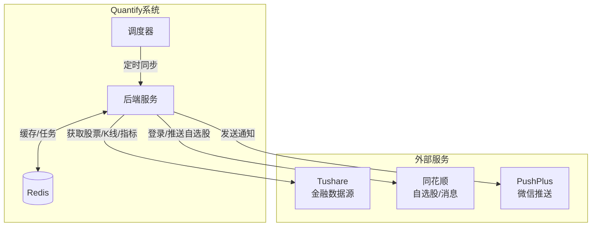
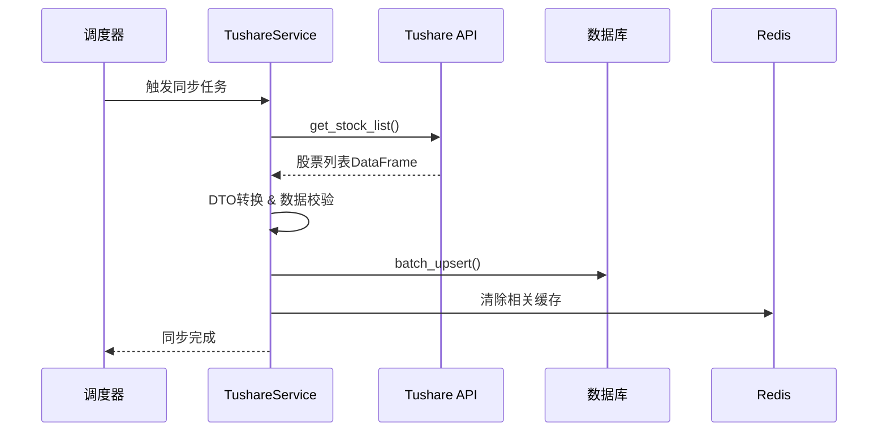
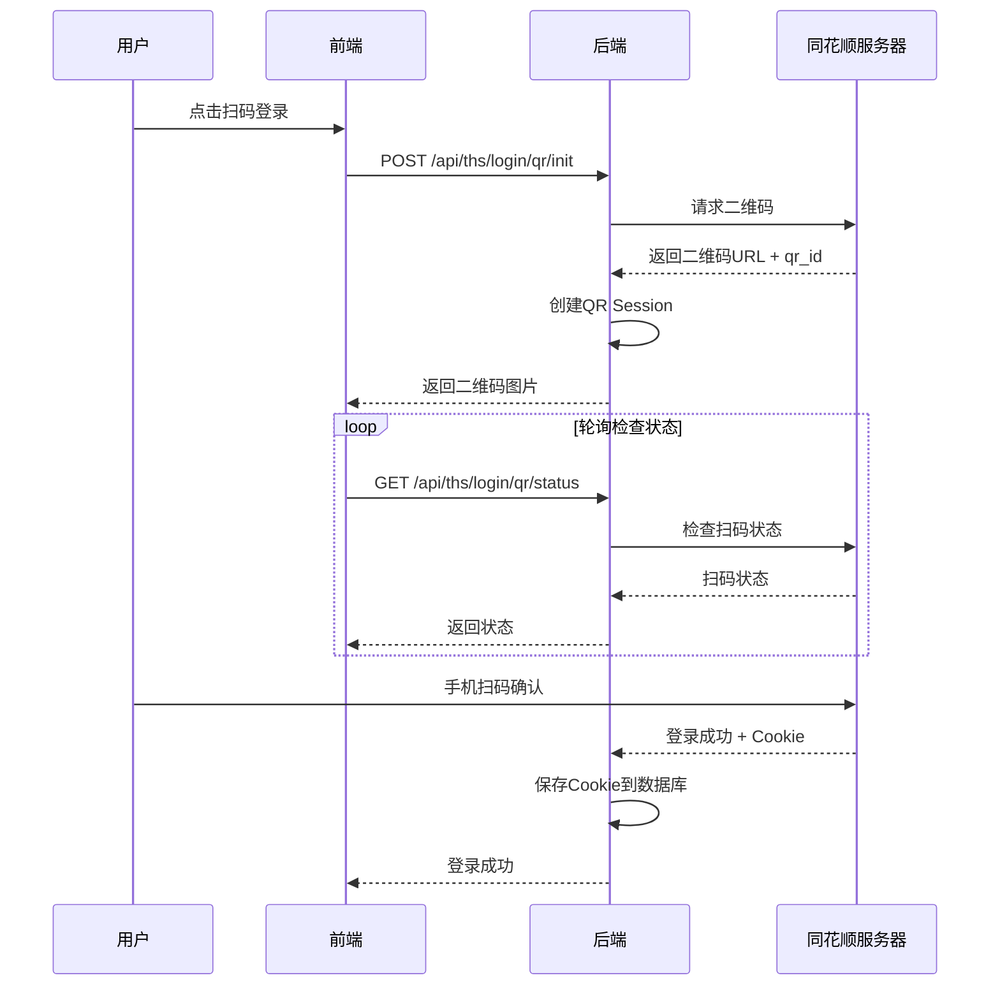
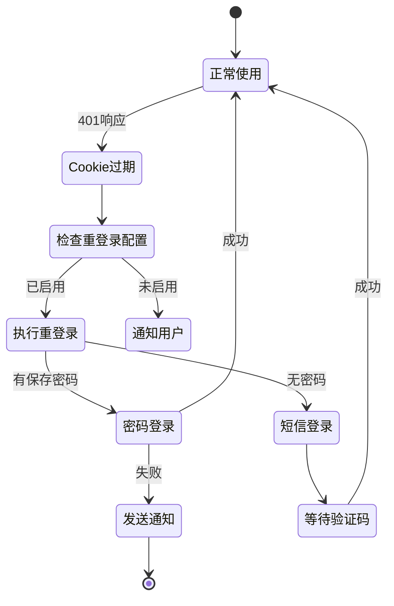
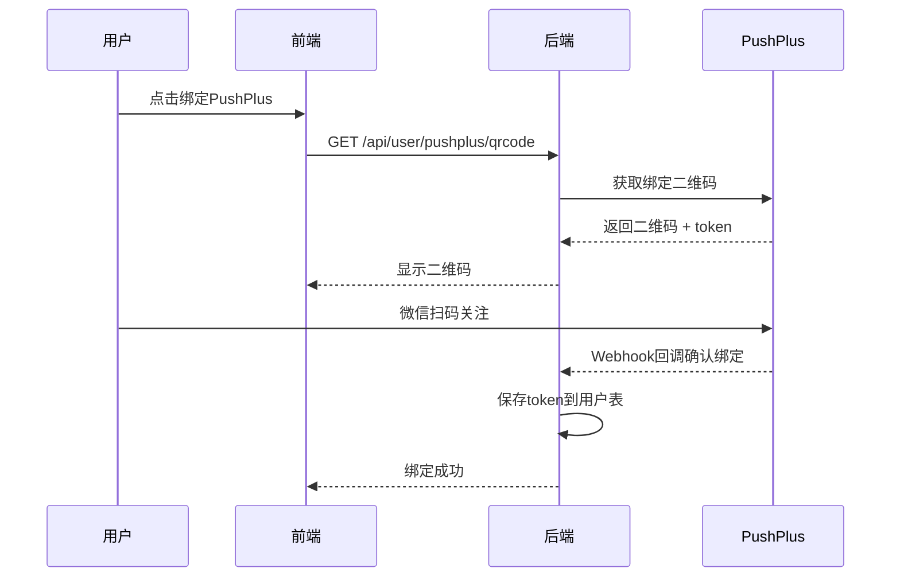

# 外部服务集成指南

> 本文档详细介绍系统与外部服务的集成实现，包括数据源、第三方平台等。

[← 返回后端总览](BACKEND_OVERVIEW.md)

---

## 目录
1. [集成架构总览](#1-集成架构总览)
2. [Tushare金融数据集成](#2-tushare金融数据集成)
3. [同花顺集成](#3-同花顺集成)
4. [PushPlus消息推送](#4-pushplus消息推送)
5. [集成设计模式](#5-集成设计模式)
6. [面试问答](#6-面试问答)

---

## 1. 集成架构总览



### 集成服务一览

| 服务 | 用途 | 模块路径 |
|------|------|----------|
| **Tushare** | 股票/可转债/概念/行业数据 | `external/tushare_service.py` |
| **同花顺** | 扫码登录、自选股推送 | `external/ths/` |
| **PushPlus** | 微信消息推送 | `external/pushplus_service.py` |

---

## 2. Tushare金融数据集成

### 2.1 服务架构

```
external/
├── tushare_service.py     # 主服务类 (1219行, 37个方法)
├── tushare_client.py      # API客户端封装
└── tushare/
    ├── dto.py             # 数据传输对象
    ├── mappers.py         # 数据映射器
    └── constants.py       # 常量定义
```

### 2.2 核心功能

| API方法 | 功能 | Tushare接口 |
|---------|------|-------------|
| `get_stock_list()` | 获取A股列表 | `stock_basic` |
| `get_daily_data()` | 日线行情 | `daily` |
| `get_weekly_data()` | 周线行情 | `weekly` |
| `get_monthly_data()` | 月线行情 | `monthly` |
| `get_auction_data()` | 开盘竞价数据 | `stk_auction_o` |
| `get_daily_basic()` | 每日指标(市值等) | `daily_basic` |
| `get_trade_cal()` | 交易日历 | `trade_cal` |
| `get_convertible_bond_basic()` | 可转债基本信息 | `cb_basic` |
| `get_ths_concept()` | 同花顺概念指数 | `ths_index` |
| `get_ths_industry()` | 同花顺行业指数 | `ths_index` |
| `get_ths_member()` | 概念/行业成分股 | `ths_member` |
| `get_ths_hot()` | 热度数据 | `ths_hot` |

### 2.3 频率控制机制

```python
class TushareService:
    def __init__(self):
        # 频率策略配置
        self._rate_policies = {
            'daily': {
                'per_minute': 400,   # 每分钟限制
                'per_second': 10,    # 每秒限制
                'burst': 20,         # 突发上限
                'concurrency': 5,    # 并发数
                'retries': 3,        # 重试次数
            },
            'ths_member': {
                'per_minute': 200,   # 更严格的限制
                'per_second': 5,
                ...
            },
        }
        
        # 线程锁（防止并发超限）
        self._rate_lock = threading.Lock()
```

**限流实现**:
```python
def _call_pro(self, api_name, **kwargs):
    """带限流的API调用"""
    with self._rate_lock:
        # 检查频率限制
        policy = self._rate_policies.get(api_name, self._default_policy)
        self._wait_if_rate_limited(api_name, policy)
        
        # 调用API
        result = self.pro.query(api_name, **kwargs)
        
        # 记录调用时间
        self._record_call(api_name)
        
        return result
```

### 2.4 数据同步流程



### 2.5 DTO模式

```python
# dto.py - 数据传输对象

@dataclass
class StockDTO:
    """股票基础信息DTO"""
    ts_code: str
    symbol: str
    name: str
    area: Optional[str] = None
    industry: Optional[str] = None
    market: Optional[str] = None
    list_date: Optional[str] = None
    is_hs: Optional[str] = None

@dataclass
class StockKlineDTO:
    """股票K线DTO"""
    ts_code: str
    trade_date: str
    open: float
    high: float
    low: float
    close: float
    pre_close: Optional[float] = None
    change: Optional[float] = None
    pct_chg: Optional[float] = None
    vol: Optional[float] = None
    amount: Optional[float] = None
```

---

## 3. 同花顺集成

### 3.1 服务架构

```
external/ths/
├── __init__.py
├── auth/                          # 认证模块
│   ├── login_service.py           # 登录服务 (16K)
│   ├── auto_relogin_service.py    # 自动重登录 (24K)
│   ├── qr_session_manager.py      # 二维码会话管理 (15K)
│   ├── sms_session_manager.py     # 短信会话管理
│   ├── user_info_mapper.py        # 用户信息映射
│   └── methods/
│       ├── password.py            # 密码登录
│       ├── qr.py                  # 扫码登录
│       └── sms.py                 # 短信登录
├── favorites/                     # 自选股模块
│   ├── favorite_service.py        # 自选股服务
│   └── ...
├── core/                          # 核心工具
│   └── constants.py               # 常量定义
└── js/                            # JS加密脚本
    └── ...
```

### 3.2 登录流程

#### 3.2.1 扫码登录



#### 3.2.2 登录方式

| 方式 | 文件 | 特点 |
|------|------|------|
| **扫码登录** | `methods/qr.py` | 无需账号密码，安全 |
| **短信登录** | `methods/sms.py` | 需要手机验证码 |
| **密码登录** | `methods/password.py` | 传统方式，密码加密存储 |
| **Cookie登录** | 直接导入 | 恢复已有会话 |

### 3.3 自动重登录机制



**核心代码**:
```python
# auto_relogin_service.py

class AutoReloginService:
    @staticmethod
    async def trigger_auto_relogin(user, ths_account_obj):
        """触发自动重登录"""
        # 1. 检查是否启用自动重登录
        if not ths_account_obj.auto_relogin_enabled:
            return {"success": False, "reason": "未启用自动重登录"}
        
        # 2. 确定登录方式
        method = ths_account_obj.last_login_method
        
        # 3. 执行重登录
        if method == "password":
            return await cls.password_auto_relogin(user, ths_account_obj)
        elif method == "sms":
            return await cls.sms_auto_relogin(user, ths_account_obj)
        else:
            # 发送PushPlus通知，提醒用户手动登录
            await cls.send_relogin_notification(user, ths_account_obj)
            return {"success": False, "reason": "需要手动登录"}
```

### 3.4 自选股推送

```python
# favorite_service.py

class ThsFavoriteService:
    async def push_to_ths(self, user_id, codes, group_name):
        """推送股票到同花顺自选股"""
        # 1. 获取用户的同花顺Cookie
        ths_account = await self.get_active_account(user_id)
        
        # 2. 构造请求
        payload = {
            "codes": codes,
            "group_name": group_name,
        }
        
        # 3. 调用同花顺API
        response = await self.ths_client.post(
            "/api/favorite/add",
            cookies=ths_account.cookie,
            json=payload
        )
        
        return response.json()
```

### 3.5 Cookie加密存储

```python
# auth.py

from cryptography.fernet import Fernet
from cryptography.hazmat.primitives.kdf.pbkdf2 import PBKDF2HMAC

def encrypt_password(password: str) -> str:
    """使用Fernet加密密码"""
    # 从SECRET_KEY派生加密密钥
    kdf = PBKDF2HMAC(algorithm=hashes.SHA256(), ...)
    key = base64.urlsafe_b64encode(kdf.derive(SECRET_KEY.encode()))
    
    fernet = Fernet(key)
    return fernet.encrypt(password.encode()).decode()

def decrypt_password(encrypted: str) -> str:
    """解密密码"""
    fernet = Fernet(derived_key)
    return fernet.decrypt(encrypted.encode()).decode()
```

---

## 4. PushPlus消息推送

### 4.1 服务架构

```python
# pushplus_service.py

class PushPlusService:
    """PushPlus微信推送服务"""
    
    BASE_URL = "https://www.pushplus.plus"
    
    async def send_message(self, user_id, title, content, template="html"):
        """发送消息到用户微信"""
        # 1. 获取用户的PushPlus token
        token = await self.get_user_token(user_id)
        
        # 2. 调用PushPlus API
        response = await httpx.post(
            f"{self.BASE_URL}/send",
            json={
                "token": token,
                "title": title,
                "content": content,
                "template": template,
            }
        )
        
        return response.json()
```

### 4.2 使用场景

| 场景 | 触发条件 | 消息内容 |
|------|----------|----------|
| **登录过期提醒** | 同花顺Cookie失效 | "您的同花顺登录已过期，请重新登录" |
| **策略执行完成** | 策略筛选完成 | "策略执行完成，共筛选出X只股票" |
| **异常告警** | 系统错误 | "数据同步异常：..." |

### 4.3 Token绑定流程



---

## 5. 集成设计模式

### 5.1 统一客户端封装

```python
class ExternalClient:
    """外部服务客户端基类"""
    
    def __init__(self, base_url, timeout=30):
        self.client = httpx.AsyncClient(
            base_url=base_url,
            timeout=timeout,
        )
    
    async def request(self, method, path, **kwargs):
        """统一请求入口"""
        try:
            response = await self.client.request(method, path, **kwargs)
            response.raise_for_status()
            return response.json()
        except httpx.HTTPError as e:
            logger.error(f"外部请求失败: {e}")
            raise ExternalServiceError(str(e))
```

### 5.2 DTO数据转换

```python
# mappers.py

def map_tushare_to_stock(row: pd.Series) -> StockDTO:
    """Tushare数据 -> 内部DTO"""
    return StockDTO(
        ts_code=row['ts_code'],
        symbol=row['symbol'],
        name=row['name'],
        area=row.get('area'),
        industry=row.get('industry'),
        ...
    )

def map_stock_to_model(dto: StockDTO) -> Stock:
    """DTO -> 数据库模型"""
    return Stock(
        ts_code=dto.ts_code,
        symbol=dto.symbol,
        name=dto.name,
        ...
    )
```

### 5.3 重试和降级

```python
from tenacity import retry, stop_after_attempt, wait_exponential

@retry(
    stop=stop_after_attempt(3),
    wait=wait_exponential(multiplier=1, min=2, max=10)
)
async def call_external_api():
    """带重试的外部API调用"""
    return await client.get("/api/data")
```

---

## 6. 面试问答

### Q1: 如何处理Tushare API的频率限制？

**答**: 多级频率控制：
1. **接口级策略**: 不同接口配置不同限制（daily: 400/分钟，ths_member: 200/分钟）
2. **线程锁**: 使用 `threading.Lock` 防止并发超限
3. **调用记录**: 记录每次调用时间，计算是否超限
4. **自动等待**: 超限时自动等待到下一个窗口期

### Q2: 同花顺登录态过期如何处理？

**答**: 自动重登录机制：
1. 检测401响应，触发自动重登录流程
2. 优先使用密码登录（如果有加密存储的密码）
3. 否则尝试短信登录，发送验证码到手机
4. 失败时通过PushPlus通知用户手动登录
5. 密码使用Fernet对称加密存储

### Q3: 如何保证外部服务调用的可靠性？

**答**: 多层保障：
1. **超时设置**: 每个请求设置合理超时
2. **重试机制**: 使用tenacity库实现指数退避重试
3. **降级策略**: 外部服务不可用时返回缓存数据
4. **异常隔离**: 外部服务异常不影响主流程

### Q4: 数据同步如何保证一致性？

**答**: 
1. **增量同步**: 只同步变更数据，减少数据量
2. **事务操作**: 批量写入使用数据库事务
3. **幂等设计**: 使用 UPSERT 操作，重复执行结果一致
4. **缓存清理**: 同步后主动清理相关缓存

---

[← 返回后端总览](BACKEND_OVERVIEW.md)
