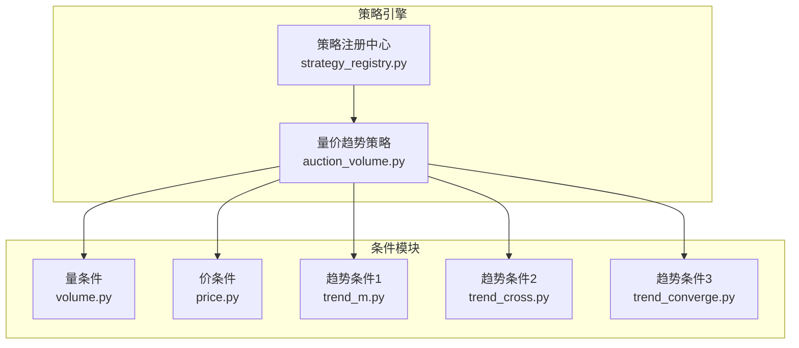

# 策略引擎指南

[← 返回后端总览](BACKEND_OVERVIEW.md)

## 策略引擎架构



---

## 1. 条件注册机制

### 1.1 注册中心 (`conditions/__init__.py`)

```python
conditions_registry = {}

def register_condition(
    key: str,
    label: str,
    type: str,
    supported_entity_types: List[str],
    parameters: Dict,
    execute_fn: Callable
):
    """注册条件模块"""
    conditions_registry[key] = {
        'key': key,
        'label': label,
        'type': type,
        'supported_entity_types': supported_entity_types,
        'parameters': parameters,
        'execute': execute_fn
    }
```

### 1.2 条件执行流程

```python
def execute_condition(
    key: str,
    candidates: List[str],
    kline_data: Dict,
    context: Dict
) -> Optional[List[str]]:
    """执行条件筛选"""
    condition = conditions_registry.get(key)
    if not condition:
        return None
    
    # 检查启用开关
    enable_key = f"enable_{key}"
    if not context.get(enable_key, False):
        return None  # 跳过此条件
    
    # 执行条件
    return condition['execute'](candidates, kline_data, context)
```

---

## 2. 条件模块详解

### 2.1 量条件 (`volume.py`)

筛选成交量符合条件的标的。

**参数**:
| 参数 | 说明 | 默认值 |
|------|------|--------|
| `enable_volume` | 启用开关 | False |
| `volume_sources` | 数据源 | ['auction'] |
| `window_n` | 回溯天数 | 5 |
| `volume_multiple` | 倍数阈值 | 2.0 |

**数据源**:
- `auction` - 竞价量
- `high_open` - 高开量
- `first_burst` - 首爆量

**逻辑**:
```python
def execute(candidates, kline_data, context, **params):
    window_n = params.get('window_n', 5)
    multiple = params.get('volume_multiple', 2.0)
    
    result = []
    for code in candidates:
        data = kline_data.get(code, [])
        if len(data) < window_n + 1:
            continue
        
        # 计算均值
        avg = sum(d['auction_vol'] for d in data[1:window_n+1]) / window_n
        today = data[0]['auction_vol']
        
        # 判断倍数
        if avg > 0 and today / avg >= multiple:
            result.append(code)
    
    return result
```

### 2.2 价条件 (`price.py`)

包含振幅筛选和涨停筛选两个独立条件。

#### 振幅筛选
**参数**:
| 参数 | 说明 | 默认值 |
|------|------|--------|
| `enable_price` | 启用开关 | False |
| `amplitude_days_window` | 振幅窗口 | 20 |
| `min_avg_amplitude` | 最小振幅% | 3.0 |

**逻辑**:
```python
# 计算振幅 = (最高 - 最低) / 昨收 * 100
amplitude = (high - low) / pre_close * 100

# 平均振幅 >= 阈值
avg_amplitude = sum(amplitudes) / len(amplitudes)
if avg_amplitude >= min_avg_amplitude:
    result.append(code)
```

#### 涨停筛选
**参数**:
| 参数 | 说明 | 默认值 |
|------|------|--------|
| `enable_limit_up_filter` | 启用开关 | False |
| `limit_up_days_window` | 统计窗口 | 250 |
| `min_limit_up_count` | 最少次数 | 1 |

**涨停判定**:
- 主板: 10%
- 创业板/科创板: 20%

### 2.3 趋势条件1 - 均线排列 (`trend_m.py`)

筛选AB线多头或空头排列的标的。

**参数**:
| 参数 | 说明 |
|------|------|
| `enable_trend_m` | 启用开关 |
| `m_days` | M日内判断 |
| `ab_up_series` | 多头选项 |
| `ab_down_series` | 空头选项 |
| `monotonic_type` | 单调类型 |

**AB线定义**:
- A线: 短期EXPMA (A1<A2<A3<A4)
- B线: 长期EXPMA (B1<B2<B3<B4)

### 2.4 趋势条件2 - EXPMA偏离 (`trend_cross.py`)

筛选价格相对EXPMA偏离符合条件的标的。

**参数**:
| 参数 | 说明 | 默认值 |
|------|------|--------|
| `enable_trend_cross` | 启用开关 | False |
| `cross_expma_periods` | EXPMA周期 | [250] |
| `cross_price_types` | 价格类型 | ['close'] |
| `cross_threshold` | 偏离阈值% | 2.0 |
| `cross_days_window` | 观察窗口 | 5 |

**逻辑**:
```python
# 偏离度 = (价格 - EXPMA) / EXPMA * 100
deviation = (close - expma) / expma * 100

# 窗口内达到阈值
if any(abs(d) >= threshold for d in deviations):
    result.append(code)
```

### 2.5 趋势条件3 - 趋势收敛 (`trend_converge.py`)

筛选两条线趋于收敛的标的。

**参数**:
| 参数 | 说明 |
|------|------|
| `enable_trend_converge` | 启用开关 |
| `converge_line_pairs` | 线对选择 |
| `converge_trend_types` | 趋势类型 |
| `converge_window` | 观察窗口 |

---

## 3. 添加新条件

### 3.1 创建条件文件

```python
# app/strategies/conditions/my_condition.py

from loguru import logger
from . import register_condition

def execute(candidates, kline_data, context, **params):
    """执行我的条件筛选"""
    enable = params.get('enable_my_condition', False)
    if not enable:
        return None
    
    threshold = params.get('my_threshold', 10)
    
    result = []
    for code in candidates:
        data = kline_data.get(code, [])
        if len(data) > 0 and meets_condition(data, threshold):
            result.append(code)
    
    logger.info(f"我的条件筛选: {len(candidates)} -> {len(result)}")
    return result

# 注册条件
register_condition(
    key='my_condition',
    label='我的条件',
    type='filter',
    supported_entity_types=['stock', 'bond'],
    parameters={
        'enable_my_condition': {'type': 'boolean', 'default': False},
        'my_threshold': {'type': 'number', 'default': 10},
    },
    execute_fn=execute
)
```

### 3.2 在策略中使用

```python
# app/strategies/auction_volume.py

from .conditions import execute_condition

def execute(context, helpers):
    candidates = helpers.get_candidate_codes(context)
    kline_data = helpers.batch_get_kline_data(...)
    
    # 执行新条件
    result = execute_condition('my_condition', candidates, kline_data, context)
    if result is not None:
        candidates = result
    
    return candidates
```

### 3.3 前端配置UI

在 `AuctionVolumeConfig.tsx` 中添加对应的UI控件。

---

## 4. 条件组合逻辑

多个条件采用 **AND** 关系：

```
最终结果 = 候选 ∩ 条件1结果 ∩ 条件2结果 ∩ ...
```

如果条件返回 `None`，表示跳过该条件，不影响其他结果。

---

[← 返回后端总览](BACKEND_OVERVIEW.md)
