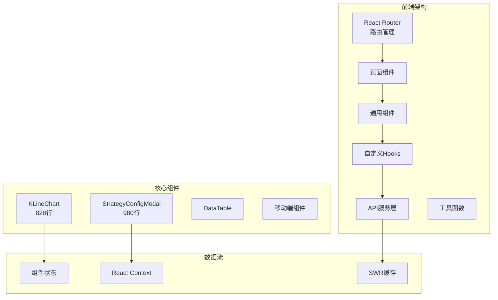
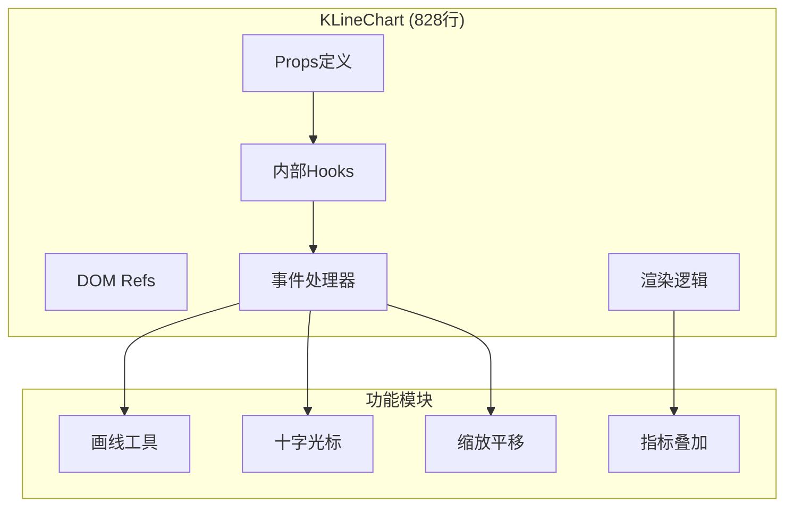
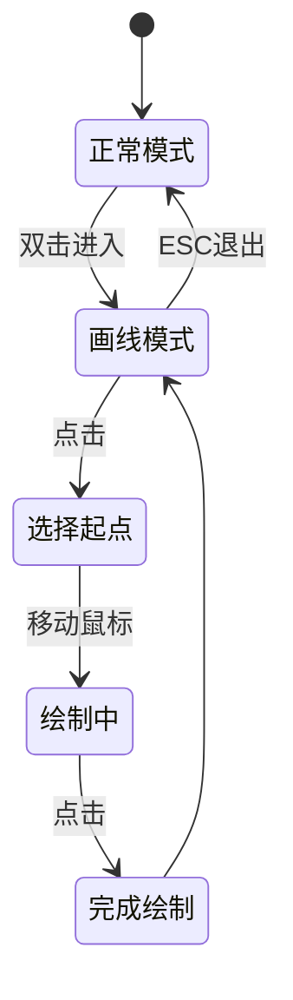
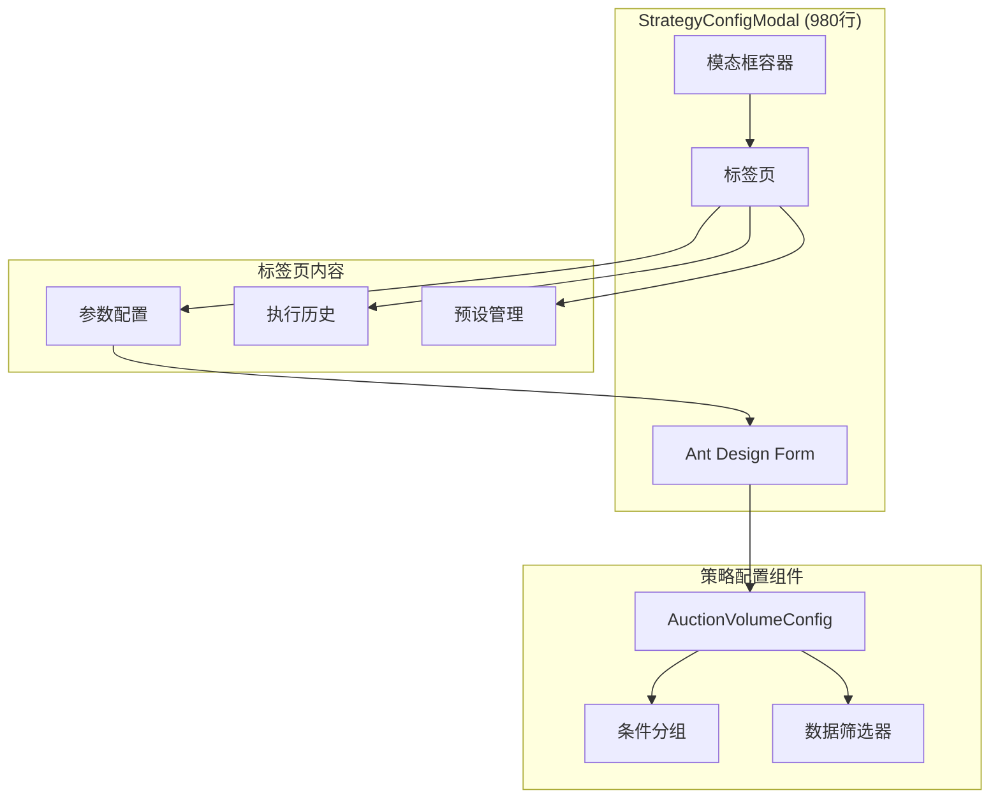
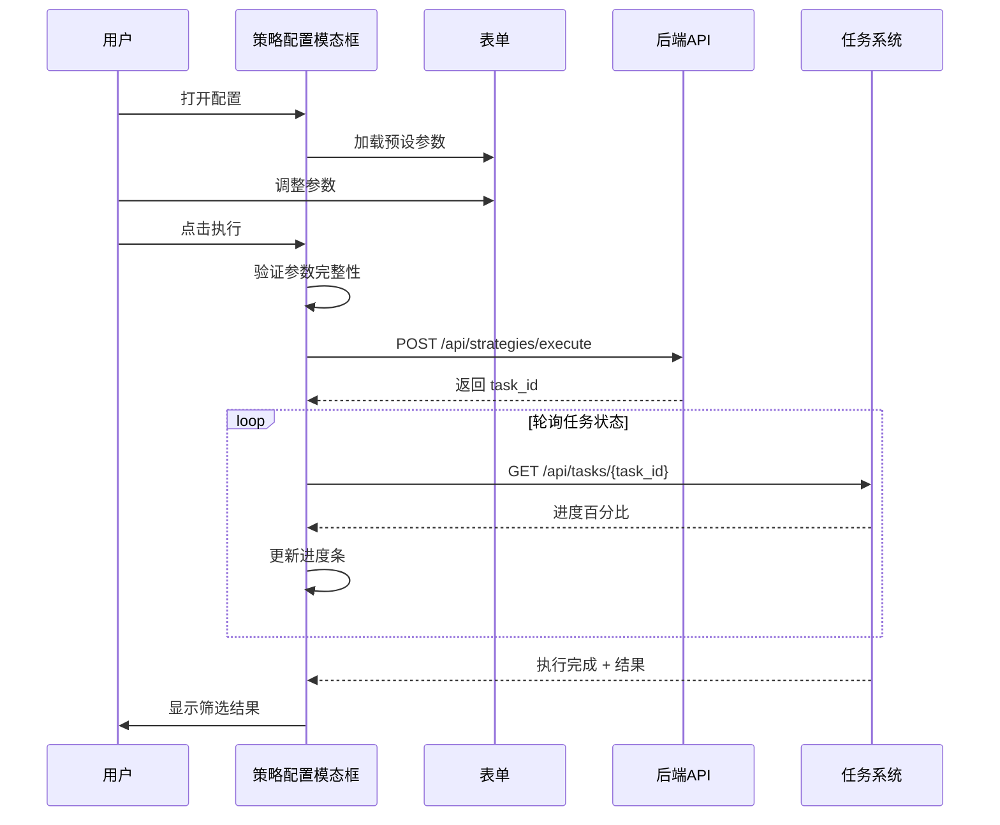
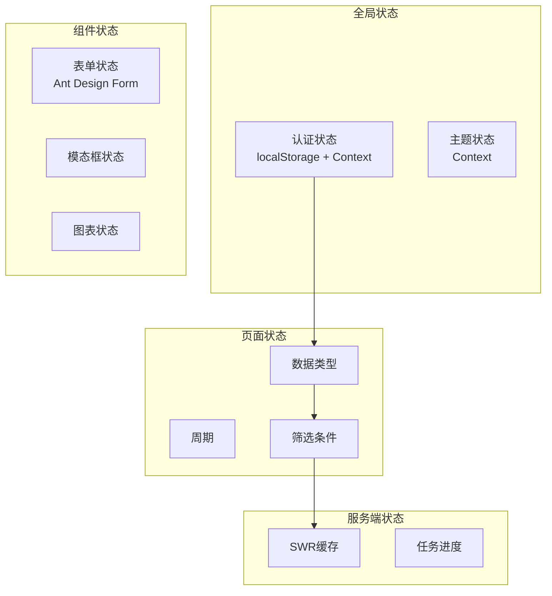

# 前端架构深度解析

> 本文档详细介绍前端核心模块的设计思想和实现逻辑，适合面试准备和项目理解。

[← 返回前端总览](FRONTEND_OVERVIEW.md)

---

## 目录
1. [技术架构总览](#1-技术架构总览)
2. [核心设计模式](#2-核心设计模式)
3. [K线图表实现](#3-k线图表实现)
4. [策略配置系统](#4-策略配置系统)
5. [状态管理方案](#5-状态管理方案)
6. [移动端适配](#6-移动端适配)
7. [亮点技术实现](#7-亮点技术实现)
8. [面试问答准备](#8-面试问答准备)

---

## 1. 技术架构总览



### 1.1 技术栈

| 技术 | 版本 | 用途 |
|------|------|------|
| React | 18+ | UI框架 |
| TypeScript | 5+ | 类型安全 |
| Vite | 5+ | 构建工具 |
| Ant Design | 5+ | UI组件库 |
| ECharts | 5+ | K线图表 |
| React Router | 6+ | 路由管理 |

### 1.2 目录结构

```
frontend/src/
├── components/           # 通用组件
│   ├── KLineChart.tsx    # K线图表 (828行)
│   ├── StrategyConfigModal.tsx  # 策略配置 (980行)
│   ├── DataTable.tsx     # 数据表格
│   ├── Sidebar.tsx       # 侧边栏
│   └── mobile/           # 移动端组件
├── pages/                # 页面组件
├── hooks/                # 自定义Hooks
├── strategies/           # 策略配置组件
├── services/             # API服务
└── utils/                # 工具函数
```

---

## 2. 核心设计模式

### 2.1 组合组件模式 (Compound Components)

**应用场景**: K线图表工具栏

```tsx
// 主组件提供上下文
<KLineChart.Provider>
  <KLineChart.Canvas />
  <KLineChart.Toolbar>
    <KLineChart.PeriodSelector />
    <KLineChart.IndicatorSelector />
    <KLineChart.DrawingTools />
  </KLineChart.Toolbar>
</KLineChart.Provider>
```

### 2.2 受控/非受控组件模式

**应用场景**: 策略配置表单

```tsx
// 受控组件 - 表单状态由父组件管理
<StrategyConfigModal
  open={isOpen}
  savedConfig={config}           // 受控：配置由父组件传入
  onSaveConfig={handleSave}      // 回调通知父组件
  onApplyStrategyFilter={handleApply}
/>

// 内部使用 Ant Design Form 进行表单状态管理
const [form] = Form.useForm();
```

### 2.3 渲染属性模式 (Render Props)

**应用场景**: 数据加载状态处理

```tsx
const DataLoader = ({ children, loading, error, data }) => {
  if (loading) return <Skeleton />;
  if (error) return <ErrorDisplay error={error} />;
  return children(data);
};

// 使用
<DataLoader {...klineQuery}>
  {(data) => <KLineChart data={data} />}
</DataLoader>
```

### 2.4 自定义Hook模式

**应用场景**: 数据获取与状态封装

```tsx
// useKLineData.ts
function useKLineData(tsCode: string, period: string) {
  const [data, setData] = useState<KLineData[]>([]);
  const [loading, setLoading] = useState(true);
  const [error, setError] = useState<Error | null>(null);
  
  useEffect(() => {
    const fetchData = async () => {
      setLoading(true);
      try {
        const response = await api.getKLine(tsCode, period);
        setData(response.data);
      } catch (err) {
        setError(err);
      } finally {
        setLoading(false);
      }
    };
    fetchData();
  }, [tsCode, period]);
  
  return { data, loading, error, refetch: fetchData };
}
```

---

## 3. K线图表实现

### 3.1 组件架构



### 3.2 核心Props设计

```typescript
interface KLineChartProps {
  // 必需
  ts_code: string;
  dataType: 'stock' | 'convertible_bond' | 'concept' | 'industry';
  
  // 尺寸
  width?: number | string;
  height?: number | string;
  
  // 数据控制
  period?: string;              // daily/weekly/monthly
  initialCount?: number;        // 初始显示条数
  timeRange?: number | string;  // 时间范围
  tradeDate?: string;           // 指定交易日
  
  // 指标
  indicator?: string;           // 副图指标
  mainIndicators?: string[];    // 主图指标
  
  // 交互
  enableCrosshair?: boolean;
  isFullscreen?: boolean;
  
  // 移动端适配
  isMobile?: boolean;
  showYAxis?: boolean;
  showInfoBar?: boolean;
  
  // 主题
  colorScheme?: 'red-up-green-down' | 'green-up-red-down';
  
  // 回调
  onLatestDataUpdate?: (data: KLineData) => void;
}
```

### 3.3 画线工具实现



**核心代码**:
```tsx
// 进入画线模式
const handleEnterDrawingMode = (e?: React.MouseEvent) => {
  e?.preventDefault();
  e?.stopPropagation();
  
  setIsDrawingMode(true);
  
  // 通知ECharts进入绘制状态
  if (chartRef.current) {
    chartRef.current.bindZoomEvent('bindZoomEvent');
  }
};

// 画线数据结构
interface DrawingLine {
  id: string;
  type: 'line' | 'segment' | 'ray';
  points: [Point, Point];
  color: string;
  width: number;
}
```

### 3.4 指标叠加

```typescript
// 支持的指标类型
const INDICATORS = {
  // 主图指标
  main: ['MA', 'EMA', 'EXPMA', 'BOLL'],
  // 副图指标
  sub: ['MACD', 'KDJ', 'RSI', 'VOL', 'AMOUNT'],
};

// 指标计算 (utils/indicators.ts)
export function calculateMA(data: number[], period: number): number[] {
  const result: number[] = [];
  for (let i = 0; i < data.length; i++) {
    if (i < period - 1) {
      result.push(NaN);
    } else {
      const sum = data.slice(i - period + 1, i + 1).reduce((a, b) => a + b, 0);
      result.push(sum / period);
    }
  }
  return result;
}
```

### 3.5 性能优化

```tsx
// 使用 React.memo + 自定义比较函数
const KLineChart = React.memo(
  forwardRef<KLineChartRef, KLineChartProps>(KLineChartInner),
  (prevProps, nextProps) => {
    // 只有关键props变化时才重新渲染
    return (
      prevProps.ts_code === nextProps.ts_code &&
      prevProps.period === nextProps.period &&
      prevProps.indicator === nextProps.indicator &&
      prevProps.refreshKey === nextProps.refreshKey &&
      prevProps.isFullscreen === nextProps.isFullscreen &&
      prevProps.timeRange === nextProps.timeRange
    );
  }
);
```

---

## 4. 策略配置系统

### 4.1 组件架构



### 4.2 策略执行流程



### 4.3 参数构建

```typescript
// 构建策略上下文
const buildContext = () => {
  const values = form.getFieldsValue();
  
  return {
    // 基础参数
    entity_type: toEntityType(dataType),
    period: globalPeriod,
    trade_date: tradeDate,
    
    // 数据筛选
    selected_concepts: values.selected_concepts,
    selected_industries: values.selected_industries,
    enable_circ_mv: values.enable_circ_mv,
    circ_mv_min: values.circ_mv_min,
    circ_mv_max: values.circ_mv_max,
    
    // 板块筛选
    filter_chinext: values.filter_chinext,
    filter_star: values.filter_star,
    filter_bse: values.filter_bse,
    filter_st: values.filter_st,
    board_filter_mode: values.board_filter_mode,
    
    // 策略条件（从子组件收集）
    ...collectConditionParams(),
  };
};
```

### 4.4 预设管理

```typescript
// 保存预设
const handleSavePreset = async () => {
  const values = form.getFieldsValue();
  const presetName = await promptForName();
  
  await authFetch('/api/strategies/presets', {
    method: 'POST',
    body: JSON.stringify({
      name: presetName,
      strategy: strategy,
      entity_type: toEntityType(dataType),
      params: values,
    }),
  });
  
  message.success('预设保存成功');
  refreshPresets();
};

// 加载预设
const handleLoadPreset = (presetKey: string) => {
  const preset = presets.find(p => p.key === presetKey);
  if (preset) {
    form.setFieldsValue(preset.params);
    message.success(`已加载预设: ${preset.name}`);
  }
};
```

---

## 5. 状态管理方案

### 5.1 状态分层



### 5.2 认证状态管理

```typescript
// AuthContext.tsx
interface AuthState {
  isAuthenticated: boolean;
  user: User | null;
  token: string | null;
}

const AuthContext = createContext<AuthState | null>(null);

export const AuthProvider = ({ children }) => {
  const [state, setState] = useState<AuthState>(() => {
    // 从 localStorage 恢复状态
    const token = localStorage.getItem('token');
    return {
      isAuthenticated: !!token,
      token,
      user: null,
    };
  });
  
  const login = async (credentials) => {
    const response = await api.login(credentials);
    localStorage.setItem('token', response.token);
    setState({
      isAuthenticated: true,
      token: response.token,
      user: response.user,
    });
  };
  
  return (
    <AuthContext.Provider value={{ ...state, login, logout }}>
      {children}
    </AuthContext.Provider>
  );
};
```

### 5.3 请求封装

```typescript
// authFetch.ts
const authFetch = async (url: string, options?: RequestInit) => {
  const token = localStorage.getItem('token');
  
  const response = await fetch(url, {
    ...options,
    headers: {
      ...options?.headers,
      'Authorization': `Bearer ${token}`,
      'Content-Type': 'application/json',
    },
  });
  
  if (response.status === 401) {
    // Token过期，跳转登录
    localStorage.removeItem('token');
    window.location.href = '/login';
    throw new Error('Unauthorized');
  }
  
  return response.json();
};
```

---

## 6. 移动端适配

### 6.1 响应式设计

```tsx
// 检测设备类型
const isMobile = window.innerWidth <= 768;

// 条件渲染
{isMobile ? (
  <MobileLayout>
    <MobileDrawer>
      <StrategyConfig />
    </MobileDrawer>
  </MobileLayout>
) : (
  <DesktopLayout>
    <StrategyConfigModal />
  </DesktopLayout>
)}
```

### 6.2 移动端组件

```
components/mobile/
├── drawers/           # 抽屉组件
│   ├── DataTypeDrawer.tsx
│   ├── StrategyDrawer.tsx
│   └── index.ts
├── MobileToolbar.tsx  # 移动端工具栏
├── theme.ts           # 移动端主题
└── utils.ts           # 移动端工具函数
```

### 6.3 触摸事件处理

```tsx
// K线图表触摸事件
const handleTouchEnd = (e: TouchEvent) => {
  const now = Date.now();
  const DOUBLE_TAP_DELAY = 300;
  
  if (now - lastTapTimeRef.current < DOUBLE_TAP_DELAY) {
    // 双击检测
    handleEnterDrawingMode();
  }
  
  lastTapTimeRef.current = now;
};

useEffect(() => {
  if (isMobile && containerRef.current) {
    containerRef.current.bindEventListener('touchend', handleTouchEnd);
    return () => {
      containerRef.current?.removeEventListener('touchend', handleTouchEnd);
    };
  }
}, [isMobile]);
```

---

## 7. 亮点技术实现

### 7.1 虚拟滚动

```tsx
// 大数据量表格虚拟滚动
import { FixedSizeList } from 'react-window';

const VirtualTable = ({ data, rowHeight = 48 }) => (
  <FixedSizeList
    height={600}
    itemCount={data.length}
    itemSize={rowHeight}
    width="100%"
  >
    {({ index, style }) => (
      <div style={style}>
        <TableRow data={data[index]} />
      </div>
    )}
  </FixedSizeList>
);
```

### 7.2 防抖搜索

```tsx
import { useDebouncedCallback } from 'use-debounce';

const SearchInput = ({ onSearch }) => {
  const debouncedSearch = useDebouncedCallback(
    (value) => onSearch(value),
    300
  );
  
  return (
    <Input
      placeholder="搜索股票代码或名称"
      onChange={(e) => debouncedSearch(e.target.value)}
    />
  );
};
```

### 7.3 任务进度轮询

```tsx
const useTaskProgress = (taskId: string) => {
  const [progress, setProgress] = useState(0);
  const [status, setStatus] = useState<'pending' | 'running' | 'completed' | 'failed'>('pending');
  
  useEffect(() => {
    if (!taskId) return;
    
    const poll = async () => {
      const response = await authFetch(`/api/tasks/${taskId}`);
      setProgress(response.progress);
      setStatus(response.status);
      
      if (response.status === 'completed' || response.status === 'failed') {
        return; // 停止轮询
      }
      
      timeoutId = setTimeout(poll, 1000);
    };
    
    let timeoutId: NodeJS.Timeout;
    poll();
    
    return () => clearTimeout(timeoutId);
  }, [taskId]);
  
  return { progress, status };
};
```

---

## 8. 面试问答准备

### Q1: 前端项目的技术栈选型理由？

**答**: 
- **React 18**: Concurrent Mode 支持更好的用户体验，Suspense 简化加载状态处理
- **TypeScript**: 类型安全，减少运行时错误，提升代码可维护性
- **Vite**: 快速冷启动，HMR 秒级响应，开发体验优秀
- **Ant Design**: 成熟的企业级组件库，减少重复开发

### Q2: K线图表是如何实现的？

**答**: 基于 ECharts 封装的自定义组件：
1. **数据层**: 通过 useKLineData Hook 获取并缓存数据
2. **渲染层**: ECharts 配置 K线、成交量、技术指标
3. **交互层**: 自定义画线工具、缩放平移、十字光标
4. **优化**: React.memo 减少重渲染，虚拟化处理大数据量

### Q3: 如何处理表单状态管理？

**答**: Ant Design Form + 受控模式：
1. 使用 `Form.useForm()` 创建表单实例
2. 父组件通过 `savedConfig` props 传入初始值
3. 子组件通过 `Form.useWatch` 监听字段变化
4. 提交时通过 `form.getFieldsValue()` 获取完整表单数据

### Q4: 移动端适配是怎么做的？

**答**: 响应式 + 组件变体：
1. 使用 `window.innerWidth` 检测设备类型
2. 移动端使用 Drawer 替代 Modal
3. 触摸事件处理（双击进入画线模式）
4. 简化的 K线图表配置（隐藏部分指标）

### Q5: 如何处理长时间运行的任务？

**答**: 轮询 + 进度显示：
1. 提交任务立即返回 task_id
2. 前端每秒轮询任务状态 API
3. 显示进度条和阶段描述
4. 支持取消任务
5. 任务完成后停止轮询

---

[← 返回前端总览](FRONTEND_OVERVIEW.md)
