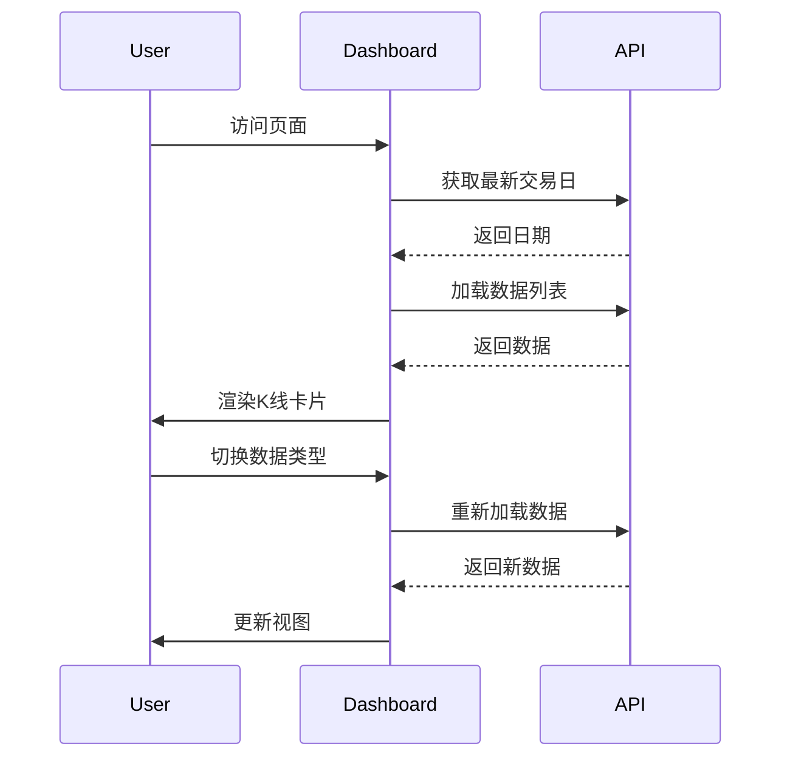

# 页面文档

[← 返回前端总览](FRONTEND_OVERVIEW.md)

## 路由配置

```tsx
// App.tsx
<Routes>
  <Route path="/login" element={<Login />} />
  <Route path="/" element={<Dashboard />} />
  <Route path="/mobile" element={<MobileDashboard />} />
  <Route path="/admin" element={<AdminRoute><AdminPanel /></AdminRoute>} />
  <Route path="/relogin" element={<Relogin />} />
  <Route path="*" element={<NotFound />} />
</Routes>
```

---

## 页面详解

### 1. Dashboard - 主看板

**路径**: `pages/Dashboard.tsx`  
**样式**: `pages/Dashboard.css`

PC端主看板页面。

**组件结构**:
```
Dashboard
├── GlobalControls          # 顶部控制栏
├── KLineDataDisplay        # K线卡片网格
│   ├── KLineCard[]
│   └── PaginationPanel
└── StrategyConfigModal     # 策略配置弹窗
```

**状态管理**:
```typescript
const [entityType, setEntityType] = useState('stock');
const [period, setPeriod] = useState('daily');
const [tradeDate, setTradeDate] = useState(latestDate);
const [sortField, setSortField] = useState('');
const [pageNum, setPageNum] = useState(1);
```

**核心功能**:
- 数据类型切换 (股票/可转债/概念/行业)
- 周期切换 (日/周/月)
- 排序和筛选
- 分页浏览
- 策略执行

---

### 2. MobileDashboard - 移动端看板

**路径**: `pages/MobileDashboard.tsx`

移动端优化的看板页面。

**特点**:
- 响应式布局
- 触摸手势支持
- 底部导航
- 抽屉详情

**组件结构**:
```
MobileDashboard
├── MobileHeader            # 移动端头部
├── MobileKLineList         # K线列表
├── MobileBottomNav         # 底部导航
└── DetailDrawer            # 详情抽屉
```

---

### 3. AdminPanel - 管理后台

**路径**: `pages/AdminPanel.tsx`

管理员控制面板。

**Tab结构**:
1. **数据同步** - Tushare数据同步
2. **定时任务** - 调度器管理
3. **用户管理** - 用户和邀请码
4. **系统配置** - 推送配置等

**权限控制**:
```tsx
<AdminRoute>
  <AdminPanel />
</AdminRoute>
```

**核心功能**:
- 触发数据同步
- 管理定时任务
- 生成邀请码
- 配置策略推送

---

### 4. Login - 登录页

**路径**: `pages/Login.tsx`  
**样式**: `pages/Login.css`

用户认证页面。

**组件结构**:
```
Login
├── LoginForm           # 登录表单
└── RegisterForm        # 注册表单 (Tab切换)
```

**流程**:
1. 输入用户名密码
2. 调用 `/api/user/login`
3. 存储JWT Token
4. 跳转Dashboard

---

### 5. Relogin - 同花顺重登录

**路径**: `pages/Relogin.tsx`

同花顺会话过期后的重登录页面。

**流程**:
1. 获取登录二维码
2. 用户扫码
3. 轮询检查状态
4. 登录成功后返回

---

### 6. NotFound - 404页面

**路径**: `pages/NotFound.tsx`

路由未匹配时的404页面。

---

## 页面生命周期

### Dashboard 典型流程



---

[← 返回前端总览](FRONTEND_OVERVIEW.md)
